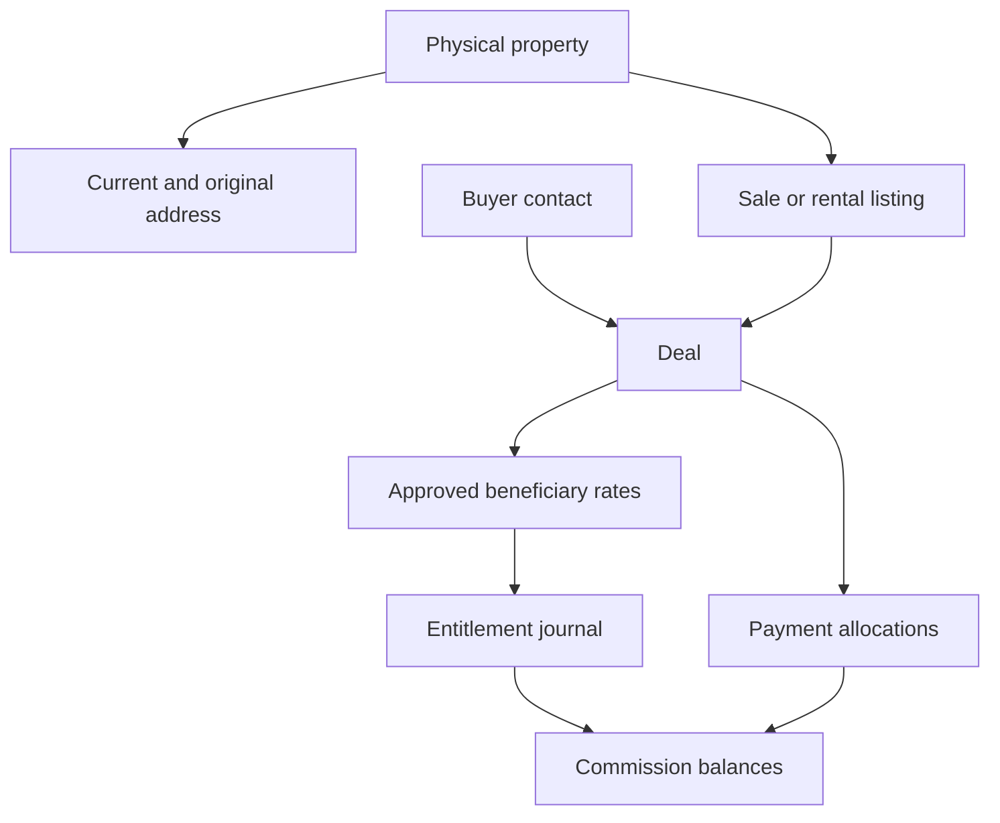

# SGN database contract

Contract version **1.0.0**, 8 October 2026. Applies to all application, backend, agent, import and reporting work in `Leonard-Data/SGN`.

## Authority and implementation status

The migration files in `supabase/migrations/` define executable behavior. `SCHEMA.md` and `schema.json` are generated from the catalog of the tested migration. `database-contract.json` records the integration surface. This document explains the rules that consuming code must follow.

The repository supplies database SQL, local Supabase configuration, staging tooling and synthetic tests. The accepted baseline and initial administrator are provisioned on an explicitly approved development project; [deployment evidence](DEPLOYMENT.md#approved-development-deployment-evidence) records completed catalog/Auth/Data API checks and the operator-approved reuse of an existing email-confirmed Auth identity. There are no implemented HTTP CRUD endpoints, frontend forms or committed live credentials. Examples of future client/server usage describe required integration behavior, not implemented CRUD services.

| Artifact | Agent use |
|---|---|
| `supabase/migrations/20261008083455_sgn_crm_v1.sql` | Initial table, trigger, policy, function, view and bucket implementation |
| `docs/SCHEMA.md` | Exact types, nullability, defaults, keys, checks and indexes for every field |
| `docs/schema.json` | Machine-readable catalog; read this instead of guessing column names |
| `docs/database-contract.json` | Schema boundaries, table inventory, RPC parameters and wire conventions |
| `sql/operations_examples.sql` | Synthetic SQL calls for financial and phone operations |
| `docs/DEPLOYMENT.md` | Setup, staging, review, cutover and rollback |
| `tests/SUPABASE_INTEGRATION.md` | Remaining live verification requirements |

## Database boundaries

| Schema | Contents | Exposure |
|---|---|---|
| `crm` | Operational records, global reference units/classifications, financial records and invoker read models/RPCs | Exposed through Data API; authenticated SELECT policies and explicitly authorized RPCs |
| `crm_private` | Authoritative roles, owner/customer phones, audit events, operation requests and privileged implementations | Not exposed; selected internal functions have explicit EXECUTE grants |
| `crm_import` | Source batches, redacted rows, review issues, proven aliases and source promotions | Not exposed; trusted import connection/service role only |
| `auth` / `storage` | Supabase-managed identity and object storage | Managed dependencies; do not recreate these production schemas |

`public` is not the SGN application schema. A future Supabase client must select `crm` explicitly. The local config exposes only `crm`; configure the selected cloud project's Data API independently.

All 30 SGN tables have RLS enabled. Authenticated clients have no direct table INSERT/UPDATE/DELETE grants. The service role bypasses RLS, so backend checks are mandatory before ordinary writes. Financial triggers additionally restrict posting to authorized database operations.

## Entity inventory

| Domain | Tables | Meaning |
|---|---|---|
| Company and access | `crm.organizations`, `crm.teams`, `crm.staff_profiles`, `crm_private.memberships` | Organization owns business records; active staff connects an Auth UUID to one or more authoritative roles |
| Address references | `crm.admin_unit_versions`, `crm.admin_unit_crosswalks` | Official dated administrative units and evidence-backed legacy successor mappings |
| Classification | `crm.property_types`, `crm.road_access_types` | Global codes/labels; these are the only business lookup seeds supplied |
| Property inventory | `crm.properties`, `crm.property_addresses`, `crm.listings` | Physical asset, address evidence/history, and commercial listing are separate entities |
| Contacts | `crm.contacts`, `crm_private.contact_phones`, `crm.property_contacts` | Person/company identities, private phone values and owner/representative/broker relationships |
| Sales workflow | `crm.deals`, `crm.activities` | Buyer, listing, staff/team ownership, agreement evidence and follow-up/viewing/call work |
| Commission | `crm.deal_commission_terms`, `crm.commission_entries` | Versioned approved beneficiary rates and immutable signed entitlement journal |
| Cash settlement | `crm.commission_payments`, `crm.commission_payment_allocations` | One beneficiary/payment header and positive amounts allocated to distinct deals |
| Files and history | `crm.property_files`, `crm.property_change_history` | Scoped object registry and imported property history |
| Audit and retries | `crm_private.contact_access_events`, `crm_private.audit_events`, `crm_private.operation_requests` | Phone access, database change evidence and financial request payload/result |
| Migration | `crm_import.batches`, `crm_import.source_rows`, `crm_import.issues`, `crm_import.property_aliases`, `crm_import.property_promotions` | Repeatable staging, source review and proven canonical identity mappings |



Never treat property, listing and deal IDs as interchangeable. A property can have several listings; each deal links its listing and physical property with a composite FK. A legacy `PropertyID` is deliberately nonunique because the workbook contains a collision.

## Tenant, identity and authorization contract

Tenant records carry `organization_id`. Tenant-linked FKs include both organization and entity ID; a numeric ID existing somewhere is insufficient to authorize linking it. Official administrative units and classifications are shared global references.

The database resolves the actor from `auth.uid()` and an active `crm.staff_profiles` row in the requested organization. Roles come from `crm_private.memberships`: `sales`, `manager`, `operations`, `finance`, `admin`. Roles can be combined. User-editable JWT `user_metadata`, email text, a submitted staff ID or a submitted organization ID is never authority.

| Capability | Implemented access |
|---|---|
| Organization/team/staff directory | Active members of that organization; team/staff metadata are not restricted to one's own team |
| Unit/classification lookups | Authenticated user with an Auth UUID; reference data is global |
| Property/listing reads | Admin/finance/operations have organization scope; other members see approved inventory or listings they own/create |
| Contacts and phone reveal | Admin/finance/operations organization scope; assigned staff or manager of the contact's team |
| Deals | Admin/finance organization scope, operations organization reads, manager's team, deal owner or commission participant |
| Commission terms/entries/allocations | Own beneficiary records, finance/admin organization scope, or manager's deal team |
| Payment headers | Own beneficiary records or finance/admin; team managers use scoped allocation rows/balances because a header may span teams |
| Imported property history | Operations/admin/finance; snapshots may contain historical phone information |
| Term approval and closing | Finance/admin or manager of the deal team; a beneficiary cannot approve their own term |
| Adjustment/payment/cancellation | Finance/admin with self-interest restrictions enforced by each operation |
| Ordinary mutations | No direct browser writes; trusted backend implementation still required |

The detailed predicates and activity/file exceptions are in the migration. An empty RLS result is not proof that a row does not exist. Do not expose hidden existence through alternate unscoped backend queries.

### Required backend behavior for ordinary CRUD

1. Validate the real user's session using the selected framework's supported server Auth integration.
2. Resolve active staff and membership roles through a trusted lookup; derive the organization scope.
3. Authorize the requested entity, team/assignment and action. Whitelist mutable fields; reject foreign-company IDs, role escalation and financial snapshot mutations.
4. Use service credentials only after authorization. Create related property/address/listing records in one database transaction; retire an old current address and insert its replacement atomically.
5. Record actor attribution. Database audit triggers see `auth.uid()`; a plain service-role request may produce a null audit actor. Do not present that null as the verified end-user actor. Implement an explicit trusted actor-attribution strategy before deploying general CRUD.

There is no implemented create-property transaction RPC in v1. Multiple independent PostgREST inserts are not an atomic transaction. Add a reviewed, tested RPC or a trusted transactional database operation when implementing this flow.

## Scalar and null conventions

| Value | Database type | Application boundary |
|---|---|---|
| Entity IDs | `bigint`, generated always identity where applicable | Decimal string, e.g. `"123"`; do not supply identity values on ordinary creation |
| Auth identity | `uuid` | UUID string; not a staff bigint |
| VND | `numeric(18,0)` | Whole-VND decimal string; validate before writes, because fixed-scale numeric columns can round fractions |
| Rate | `numeric(9,8)` | Fraction string, e.g. `"0.005"` for 0.5%; positive, <=1, <=8 decimal places |
| Measurements | Positive finite numeric values | Reviewed metric values; unknown is null |
| Event timestamps | `timestamptz` | ISO-8601 with timezone, preferably UTC; display in `Asia/Ho_Chi_Minh` |
| Administrative dates | `date` | `YYYY-MM-DD`; `valid_to` is exclusive |
| Official code | `text` | Keep leading zeros; 2 digits for province, 5 for commune |
| Unknown | Nullable SQL value | Preserve null; do not coerce to zero, false or empty reference ID |

Supabase JSON responses may contain numeric values as JSON numbers, including inside RPC result objects. A standard JavaScript JSON parser can lose precision before conversion to string. Use a backend decimal-preserving serializer/parser or a tested safe-range adapter. Merely calling `String()` after an unsafe JSON parse does not repair lost digits. Do not claim generated TypeScript types solve numeric precision.

## Address contract and property entry

For a newly entered property, the intended form defaults to **current province/city + current commune/ward + street + house number**. District is retained as legacy information, not required as the current hierarchy level. The backend builds and preserves `original_address` from the entered text; that field is required even for a current-format address.

`admin_unit_versions` stores official code/name/type/parent with effective dates and source evidence. Select a province valid on the address's `address_as_of` date, then communes whose `parent_version_id` matches that exact province version and whose validity covers the same date:

```sql
select id, official_code, name_vi, unit_type
from crm.admin_unit_versions
where unit_level = 'province'
  and valid_from <= :address_as_of
  and (valid_to is null or :address_as_of < valid_to)
order by name_vi, id;

select id, official_code, name_vi, unit_type
from crm.admin_unit_versions
where unit_level = 'commune'
  and parent_version_id = :province_version_id
  and valid_from <= :address_as_of
  and (valid_to is null or :address_as_of < valid_to)
order by name_vi, id;
```

These are parameterized SQL templates, not directly executable psql statements with the named placeholders. For an entry today, derive the business date in Vietnam's timezone.

The optional legacy form captures old province, district, ward and address into `original_*` fields with an explicit source era. `admin_unit_crosswalks` suggests successors from this combination. `mapping_kind` is exactly `whole_unit`, `partial_unit`, or `rename`. A `partial_unit` rule cannot determine an individual property solely from the ward name; require official street/block evidence or coordinates with authoritative dated boundaries. Approximate geocoding stays a suggestion.

Address `verification_status` is `unresolved`, `suggested`, `needs_review`, or `verified`. Verification requires the province/commune versions, as-of date, mapping method, evidence, reviewer and verification time. Allowed methods are `current_unit`, `whole_unit_crosswalk`, `official_street_rule`, `authoritative_boundary`, `manual_verified`. Only one address per property can have `is_current=true`.

`is_current` means the selected address record, not automatic legal freshness. If reference versions are retired later, a stewardship job must find and review affected current addresses. That job is not implemented. The closing RPC checks verified current-record status; it does not independently recheck legal validity against today's date or load new policy data.

Signed agreement address text belongs to `deals.agreement_address` and remains a closing snapshot. Do not rewrite it when administrative units change. Official unit records/crosswalks are not seeded in v1; load verified baseline and subsequent changes through cutover.

## Property, listing and deal lifecycle

| Field | Allowed values | Meaning |
|---|---|---|
| `listings.purpose` | `sale`, `rent` | Sale commission RPC supports sale only |
| `listings.status` | `new`, `available`, `negotiating`, `under_offer`, `sold_legacy`, `sold`, `withdrawn` | Imported sold status is not verified financial evidence |
| `listings.approval_state` | `unknown`, `pending`, `approved`, `rejected` | Separate from nullable `legacy_approved`; source approval does not auto-publish |
| `deals.stage` | `lead`, `viewing`, `negotiation`, `deposit`, `closed_won`, `closed_lost`, `cancelled` | Open workflow stages are application-managed; terminal financial actions use RPCs |

Database checks constrain value sets; they do not enforce every possible business transition between open stages. Implement action/transition rules in the trusted backend. Closing does not currently enforce listing approval state or listing price verification; it enforces verified **final deal price**, property identity, current address and terms. If publishing/closing approval gates are added, amend the SQL and tests explicitly.

`close_deal` moves the deal to `closed_won` and listing to `sold`. Only one closed sale is allowed per listing. `cancel_closed_deal` moves the deal to `cancelled` and listing to `withdrawn`; it does not republish inventory or delete settlement history. Reuse of a physical asset after cancellation requires a reviewed new listing/workflow.

## Commission and settlement contract

For each beneficiary's current approved terms:

`accrual_vnd = round(final_sale_price_vnd × rate_fraction, 0)`

The basis is the verified final **property sale price**. Commission becomes payable at `closed_at`; receipt of a brokerage fee is not a gate. Asking price, rental income, legacy “sold” and click history never synthesize commission.

Closing requires a sale listing; nonterminal deal; nonfuture closing time (five-minute tolerance); verified final price; verified property identity and a verified current address record; complete agreement reference/address/closing definition; current approved terms; aggregate rates <=1; and every beneficiary's rounded entitlement >0. The 100% cap is a sanity check, not a recommended commission rate. Company-specific rate ceilings are not configured yet.

Terms are versioned per deal/beneficiary. A new approval retires the old current version before closing; it does not rewrite its rate/evidence. At closing, journal rows snapshot term ID, rate, price and payable time. One accrual per deal/beneficiary is allowed.

Journal `entry_kind` is `accrual`, `adjustment` or `reversal`. Accrual is positive; an adjustment is nonzero signed whole VND referencing the original accrual; a reversal is negative. Entitlement cannot become negative. Cancellation reverses remaining entitlement; confirmed payouts remain recorded.

Payment `payment_kind` is `payout` or `recovery`. Amounts are positive whole VND; kind determines direction. One payment belongs to one beneficiary and can allocate to multiple distinct deals. Header total must equal allocation total. A payout cannot exceed outstanding entitlement or precede closing eligibility. A recovery cannot exceed already-paid overpayment. A payment records a confirmed cash event; it does not initiate a bank transfer.

`crm.commission_balances` is a security-invoker view grouped by organization/deal/beneficiary:

- `entitlement_vnd = sum(signed journal amounts)`
- `net_paid_vnd = payouts − recoveries`
- `outstanding_vnd = max(entitlement − net_paid, 0)`
- `recoverable_vnd = max(net_paid − entitlement, 0)`

Rows are generated from posted entitlement entries; an open deal without an accrual has no balance row. UI code should distinguish “not accrued” from a posted zero balance.

## Exact exposed RPC interfaces

All functions below are in `crm`. Arguments must use these exact names for a Data API RPC call. Actor identity comes from the actual user's authenticated session; no `actor_id` argument exists. Use `supabase.schema('crm').rpc(...)` in a future client adapter.

| RPC | Parameters in order | Return |
|---|---|---|
| `approve_commission_term` | `p_org bigint`, `p_deal bigint`, `p_beneficiary bigint`, `p_rate numeric`, `p_role text`, `p_evidence text`, `p_key text` | JSON: `term_id`, `version` |
| `close_deal` | `p_org bigint`, `p_deal bigint`, `p_closed_at timestamptz`, `p_key text` | JSON: `deal_id`, `beneficiaries`, `payable_vnd` |
| `adjust_commission` | `p_org bigint`, `p_entry bigint`, `p_amount numeric`, `p_reason text`, `p_key text` | JSON: `entry_id`, `net_entitlement_vnd` |
| `cancel_closed_deal` | `p_org bigint`, `p_deal bigint`, `p_reason text`, `p_key text` | JSON: `deal_id`, `status` |
| `record_commission_payment` | `p_org bigint`, `p_staff bigint`, `p_kind text`, `p_reference text`, `p_paid_at timestamptz`, `p_allocations jsonb`, `p_key text` | JSON: `payment_id`, `amount_vnd` |
| `reveal_contact_phones` | `p_org bigint`, `p_contact bigint` | Rows: `phone_id`, `number_e164`, `number_raw`, `verification_status` |

`p_allocations` is a nonempty JSON array of `{ "deal_id": "123", "amount_vnd": "20000000" }`; numeric strings are accepted by the SQL record conversion. IDs must be distinct, belong to the organization, and have an eligible balance for the beneficiary. `p_role` is a participant description, such as `salesperson` or `co_agent`, not a membership role grant.

Synthetic payload example; supply real authorized IDs only after resolving the current user:

```json
{
  "p_org": "1",
  "p_deal": "123",
  "p_beneficiary": "45",
  "p_rate": "0.005",
  "p_role": "salesperson",
  "p_evidence": "Approved company policy reference",
  "p_key": "term-approval:123:45:request-uuid"
}
```

### Idempotency, errors and concurrency

Every financial action requires a nonempty `p_key`. Store a key for the logical user action and reuse the exact successful request body on network retries. Same operation/organization/key/payload/actor returns the original result. A changed payload or actor under that key is rejected. Do not generate a new key for every transport retry. Phone reveal has no financial event key and logs allowed access.

Closing locks the deal and listing. Terms/corrections/cancellation serialize on the deal. Payments lock all affected deals in ascending ID order. Immutable rows and unique accrual/reference constraints provide additional protection. Failed transactions post nothing. Real multi-session race testing is still required.

Authorization failures use SQLSTATE `42501` in the privileged operations. Check and FK failures use PostgreSQL constraint error codes; many business validations use `P0001`; posted-row mutation raises `55000`. There is no stable application error-code enum yet. Handle the returned error, preserve transaction failure and present a suitable user message; do not build business logic by matching every English exception string. A backend error translation layer remains to be implemented.

## Phones, files and audit

Raw contact phones are in `crm_private.contact_phones` and cannot be directly selected by a browser. Use `reveal_contact_phones` after authorization; an allowed reveal is logged. The raised denial aborts its transaction, so do not assume every failed reveal has a persisted audit event; log denied requests in the server security layer when implementing one. Directory `staff_profiles.phone` is a separate staff field visible to organization members.

Buckets `sgn-property-images` and `sgn-agreements` are private. `crm.property_files` registers bucket/key, organization, property, optional deal, MIME/size/hash and availability. A file is readable only when registered as available and the caller can read its related property/deal. Agreement access follows deal scope; property images follow inventory scope. Object-key prefixes alone do not authorize access.

Uploads/updates/deletes require a trusted server and are not implemented as browser policies. Validate organization/resource, content type and file size before uploading, register metadata, and compensate on failed multi-service operations. Current caps are 10 MiB for property JPEG/PNG/WebP and 20 MiB for agreement PDF/JPEG/PNG. Audit preexisting broad Storage policies on a cloud project because permissive policies can combine.

Business audit snapshots and historical payloads may contain personal information. Keep private schemas unexposed and restrict export/log access. Never put raw owner phones into listing responses, public logs or AGENTS documentation.

## Source migration contract

`scripts/stage_workbook.py` reads XLSX without editing the source and emits private SQL for review staging only. Confirm source timezone explicitly. File SHA256 + company identifies a batch; sheet/row identifies a source record. Identical reruns preserve review dispositions. A different transform version/timezone for the same file is rejected.

Password fields are removed and staging rejects recognized password keys. The public repository contains aggregate counts and synthetic fixtures, not the customer workbook or generated staging payloads. Preserve original units/dates/errors for review; source numeric cells do not automatically become verified VND.

The worksheet named `Contracts` contains owner contacts, not signed sales agreements. Source legacy links are not automatically joined by row suffix, phone suffix or the duplicated PropertyID. Contacts, attachments, history and clicks stay staged until proven source aliases and identities exist.

`crm_import.promote_property(p_org bigint, p_source bigint, p_decision jsonb)` is a trusted import-only operation, not an exposed browser RPC. It requires reviewed identity/evidence/approver and resolved blocking issues. Explicitly adopted VND prices require review evidence. It creates/reuses a canonical property and creates a listing, preserves original unresolved address text, records the promotion, and never accrues legacy sold commission. See `sql/review_import.sql` for decision fields and examples.

Manual issue resolution and related-table promotion remain migration work. Imported past commission liabilities need a separate finance-approved migration with evidence; no opening balances are invented from listing status.

## Change and validation contract

For any accepted database change, add a new CLI-generated migration and update the affected human/machine contracts, examples and tests. Backward-incompatible field/RPC/permission changes require an explicit consumer migration plan and contract version change. Additive schema changes also update table/field inventories.

```bash
npm test
npm run docs
npm run check:contract
python -m py_compile scripts/stage_workbook.py
```

The test suite executes the full SQL on a local PostgreSQL engine with minimal Supabase Auth/Storage representations. Catalog generation provides the exact 30-table dictionary. Contract checks validate paths, schema boundaries, table inventory and RPC signatures against the migration/catalog.

This does not validate a live Supabase project, true parallel sessions, HTTP object operations, PostgREST schema exposure or adviser output. Complete `tests/SUPABASE_INTEGRATION.md`, verify deployed grants/RLS with `sql/verify_deployment.sql`, and load sourced administrative versions before production. Ordinary CRUD, actor attribution, frontend forms, tax/withholding, rental commission and payroll/bank integrations remain outside this initial implementation.
