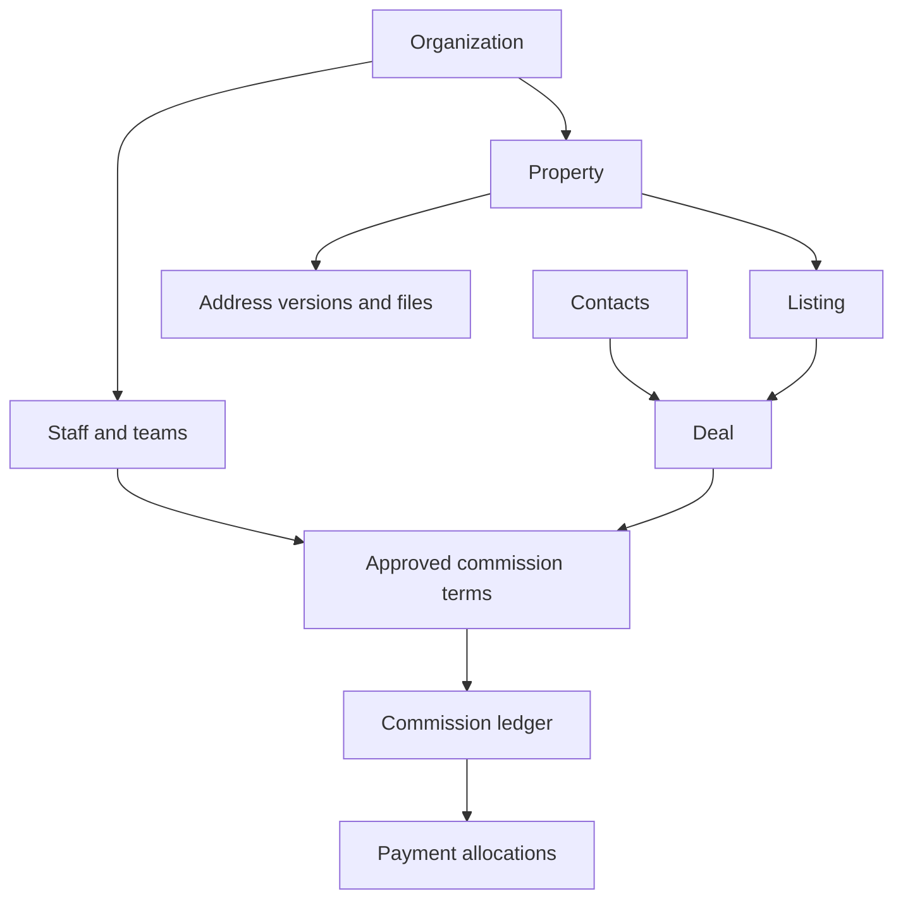

# SGN Real Estate detailed database schema

Version 1.0.0. Generated from the tested SQL catalog, with field types, nullability, defaults, primary/foreign keys, checks, unique rules, and indexes. 30 application tables across three schemas. Auth and Storage are Supabase-managed dependencies.

## Schema boundaries

| Schema | Purpose | Browser access |
|---|---|---|
| crm | Operational records, approved inventory, deals and commission | Expose in Data API; RLS SELECT plus named RPCs |
| crm_private | Role memberships, phone numbers, audit events, idempotency and privileged operations | Do not expose; only explicit function grants |
| crm_import | Source batches, redacted rows, issues, proven aliases and reviewed promotions | Do not expose; trusted import connection |

## Core relationships

Every tenant-linked relationship uses organization_id plus entity ID. This prevents a valid ID from another company becoming a foreign key. Administrative units and classification lookups are global references.

## Financial and address conventions

- Money: numeric(18,0), VND. App/backend validates whole-VND inputs before writing because fixed-scale numeric columns round fractional input. Financial RPCs explicitly reject fractional settlement/adjustment arguments.
- Rate: numeric(9,8) fraction; 0.005 means 0.5%. Positive approved rates only, aggregate closing rate at most 1. No company rate is assumed.
- Closing: final verified price × each approved direct rate, rounded to whole VND. Payable immediately at closed_at. Actual payout is a separate event.
- Journal amount is signed. Payout/recovery amounts are positive; payment_kind defines direction. Recoveries are bounded by a previously paid overpayment.
- Dates use timestamptz. Address administrative validity uses date with exclusive valid_to. Province codes are 2-character digit text; commune codes 5-character digit text.
- Nullable values represent unknowns. Do not replace unknown price, area, ward or approval state with zero/false.
- Approved commission snapshots and posted payment/ledger records cannot be updated or deleted.
- Property identity is independent of listing, deal and address. Legacy PropertyID is deliberately not unique.

## crm.activities

| Column | SQL type | Nullable | Default or identity |
|---|---|---|---|
| id | bigint | No | GENERATED ALWAYS AS IDENTITY |
| organization_id | bigint | No | — |
| contact_id | bigint | Yes | — |
| listing_id | bigint | Yes | — |
| deal_id | bigint | Yes | — |
| owner_staff_id | bigint | No | — |
| kind | text | No | — |
| body | text | No | — |
| due_at | timestamp with time zone | Yes | — |
| completed_at | timestamp with time zone | Yes | — |
| created_at | timestamp with time zone | No | now() |

Constraints:

- **activities_body_not_null:** `NOT NULL body`
- **activities_check:** `CHECK (((contact_id IS NOT NULL) OR (listing_id IS NOT NULL) OR (deal_id IS NOT NULL)))`
- **activities_created_at_not_null:** `NOT NULL created_at`
- **activities_id_not_null:** `NOT NULL id`
- **activities_kind_check:** `CHECK ((kind = ANY (ARRAY['follow_up'::text, 'viewing'::text, 'note'::text, 'call'::text])))`
- **activities_kind_not_null:** `NOT NULL kind`
- **activities_organization_id_contact_id_fkey:** `FOREIGN KEY (organization_id, contact_id) REFERENCES crm.contacts(organization_id, id)`
- **activities_organization_id_deal_id_fkey:** `FOREIGN KEY (organization_id, deal_id) REFERENCES crm.deals(organization_id, id)`
- **activities_organization_id_id_key:** `UNIQUE (organization_id, id)`
- **activities_organization_id_listing_id_fkey:** `FOREIGN KEY (organization_id, listing_id) REFERENCES crm.listings(organization_id, id)`
- **activities_organization_id_not_null:** `NOT NULL organization_id`
- **activities_organization_id_owner_staff_id_fkey:** `FOREIGN KEY (organization_id, owner_staff_id) REFERENCES crm.staff_profiles(organization_id, id)`
- **activities_owner_staff_id_not_null:** `NOT NULL owner_staff_id`
- **activities_pkey:** `PRIMARY KEY (id)`

Indexes:

- `CREATE INDEX activities_contact_idx ON crm.activities USING btree (organization_id, contact_id)`
- `CREATE INDEX activities_deal_idx ON crm.activities USING btree (organization_id, deal_id)`
- `CREATE INDEX activities_listing_idx ON crm.activities USING btree (organization_id, listing_id)`
- `CREATE UNIQUE INDEX activities_organization_id_id_key ON crm.activities USING btree (organization_id, id)`
- `CREATE INDEX activities_owner_due_idx ON crm.activities USING btree (organization_id, owner_staff_id, due_at) WHERE (completed_at IS NULL)`
- `CREATE UNIQUE INDEX activities_pkey ON crm.activities USING btree (id)`

## crm.admin_unit_crosswalks

| Column | SQL type | Nullable | Default or identity |
|---|---|---|---|
| id | bigint | No | GENERATED ALWAYS AS IDENTITY |
| original_province | text | No | — |
| original_district | text | No | ''::text |
| original_ward | text | No | — |
| original_regime | text | No | — |
| successor_version_id | bigint | No | — |
| mapping_kind | text | No | — |
| effective_from | date | No | — |
| location_rule | text | Yes | — |
| legal_source | text | No | — |

Constraints:

- **admin_unit_crosswalks_check:** `CHECK (((mapping_kind <> 'partial_unit'::text) OR (NULLIF(btrim(location_rule), ''::text) IS NOT NULL)))`
- **admin_unit_crosswalks_effective_from_not_null:** `NOT NULL effective_from`
- **admin_unit_crosswalks_id_not_null:** `NOT NULL id`
- **admin_unit_crosswalks_legal_source_not_null:** `NOT NULL legal_source`
- **admin_unit_crosswalks_mapping_kind_check:** `CHECK ((mapping_kind = ANY (ARRAY['whole_unit'::text, 'partial_unit'::text, 'rename'::text])))`
- **admin_unit_crosswalks_mapping_kind_not_null:** `NOT NULL mapping_kind`
- **admin_unit_crosswalks_original_district_not_null:** `NOT NULL original_district`
- **admin_unit_crosswalks_original_province_not_null:** `NOT NULL original_province`
- **admin_unit_crosswalks_original_province_original_district_o_key:** `UNIQUE (original_province, original_district, original_ward, original_regime, successor_version_id)`
- **admin_unit_crosswalks_original_regime_not_null:** `NOT NULL original_regime`
- **admin_unit_crosswalks_original_ward_not_null:** `NOT NULL original_ward`
- **admin_unit_crosswalks_pkey:** `PRIMARY KEY (id)`
- **admin_unit_crosswalks_successor_version_id_fkey:** `FOREIGN KEY (successor_version_id) REFERENCES crm.admin_unit_versions(id)`
- **admin_unit_crosswalks_successor_version_id_not_null:** `NOT NULL successor_version_id`

Indexes:

- `CREATE UNIQUE INDEX admin_unit_crosswalks_original_province_original_district_o_key ON crm.admin_unit_crosswalks USING btree (original_province, original_district, original_ward, original_regime, successor_version_id)`
- `CREATE UNIQUE INDEX admin_unit_crosswalks_pkey ON crm.admin_unit_crosswalks USING btree (id)`

## crm.admin_unit_versions

Official dated province/commune versions; valid_to is exclusive. No unverified code seeds.

| Column | SQL type | Nullable | Default or identity |
|---|---|---|---|
| id | bigint | No | GENERATED ALWAYS AS IDENTITY |
| official_code | text | No | — |
| unit_level | text | No | — |
| unit_type | text | No | — |
| name_vi | text | No | — |
| parent_version_id | bigint | Yes | — |
| valid_from | date | No | — |
| valid_to | date | Yes | — |
| legal_source | text | No | — |
| verified_at | timestamp with time zone | No | — |

Constraints:

- **admin_unit_versions_check:** `CHECK (((valid_to IS NULL) OR (valid_to > valid_from)))`
- **admin_unit_versions_check1:** `CHECK ((((unit_level = 'province'::text) AND (official_code ~ '^[0-9]{2}$'::text) AND (parent_version_id IS NULL) AND (unit_type = ANY (ARRAY['province'::text, 'central_city'::text]))) OR ((unit_level = 'commune'::text) AND (official_code ~ '^[0-9]{5}$'::text) AND (parent_version_id IS NOT NULL) AND (unit_type = ANY (ARRAY['ward'::text, 'commune'::text, 'special_zone'::text])))))`
- **admin_unit_versions_id_not_null:** `NOT NULL id`
- **admin_unit_versions_legal_source_check:** `CHECK ((btrim(legal_source) <> ''::text))`
- **admin_unit_versions_legal_source_not_null:** `NOT NULL legal_source`
- **admin_unit_versions_name_vi_check:** `CHECK ((btrim(name_vi) <> ''::text))`
- **admin_unit_versions_name_vi_not_null:** `NOT NULL name_vi`
- **admin_unit_versions_official_code_not_null:** `NOT NULL official_code`
- **admin_unit_versions_official_code_valid_from_key:** `UNIQUE (official_code, valid_from)`
- **admin_unit_versions_parent_version_id_fkey:** `FOREIGN KEY (parent_version_id) REFERENCES crm.admin_unit_versions(id)`
- **admin_unit_versions_pkey:** `PRIMARY KEY (id)`
- **admin_unit_versions_unit_level_check:** `CHECK ((unit_level = ANY (ARRAY['province'::text, 'commune'::text])))`
- **admin_unit_versions_unit_level_not_null:** `NOT NULL unit_level`
- **admin_unit_versions_unit_type_check:** `CHECK ((unit_type = ANY (ARRAY['province'::text, 'central_city'::text, 'ward'::text, 'commune'::text, 'special_zone'::text])))`
- **admin_unit_versions_unit_type_not_null:** `NOT NULL unit_type`
- **admin_unit_versions_valid_from_not_null:** `NOT NULL valid_from`
- **admin_unit_versions_verified_at_not_null:** `NOT NULL verified_at`

Indexes:

- `CREATE INDEX admin_parent_idx ON crm.admin_unit_versions USING btree (parent_version_id)`
- `CREATE UNIQUE INDEX admin_unit_versions_official_code_valid_from_key ON crm.admin_unit_versions USING btree (official_code, valid_from)`
- `CREATE UNIQUE INDEX admin_unit_versions_pkey ON crm.admin_unit_versions USING btree (id)`

## crm.commission_entries

Append-only signed amounts. Accruals become payable on closing; adjustments never rewrite history.

| Column | SQL type | Nullable | Default or identity |
|---|---|---|---|
| id | bigint | No | GENERATED ALWAYS AS IDENTITY |
| organization_id | bigint | No | — |
| deal_id | bigint | No | — |
| beneficiary_staff_id | bigint | No | — |
| entry_kind | text | No | — |
| amount_vnd | numeric(18,0) | No | — |
| term_id | bigint | Yes | — |
| price_snapshot_vnd | numeric(18,0) | Yes | — |
| rate_snapshot | numeric(9,8) | Yes | — |
| rounding_rule | text | No | 'round_numeric_half_away_from_zero'::text |
| payable_at | timestamp with time zone | No | — |
| event_key | text | No | — |
| reason | text | No | — |
| reference_entry_id | bigint | Yes | — |
| posted_by_staff_id | bigint | No | — |
| posted_at | timestamp with time zone | No | now() |

Constraints:

- **commission_entries_amount_vnd_check:** `CHECK (((amount_vnd <> (0)::numeric) AND (amount_vnd > '-Infinity'::numeric) AND (amount_vnd < 'Infinity'::numeric)))`
- **commission_entries_amount_vnd_not_null:** `NOT NULL amount_vnd`
- **commission_entries_beneficiary_staff_id_not_null:** `NOT NULL beneficiary_staff_id`
- **commission_entries_check:** `CHECK ((((entry_kind = 'accrual'::text) AND (amount_vnd > (0)::numeric) AND (term_id IS NOT NULL) AND (price_snapshot_vnd > (0)::numeric) AND (rate_snapshot > (0)::numeric) AND (amount_vnd = round((price_snapshot_vnd * rate_snapshot), 0)) AND (reference_entry_id IS NULL)) OR ((entry_kind = 'adjustment'::text) AND (reference_entry_id IS NOT NULL) AND (term_id IS NULL) AND (price_snapshot_vnd IS NULL) AND (rate_snapshot IS NULL)) OR ((entry_kind = 'reversal'::text) AND (amount_vnd < (0)::numeric) AND (reference_entry_id IS NOT NULL) AND (term_id IS NULL) AND (price_snapshot_vnd IS NULL) AND (rate_snapshot IS NULL))))`
- **commission_entries_deal_id_not_null:** `NOT NULL deal_id`
- **commission_entries_entry_kind_check:** `CHECK ((entry_kind = ANY (ARRAY['accrual'::text, 'adjustment'::text, 'reversal'::text])))`
- **commission_entries_entry_kind_not_null:** `NOT NULL entry_kind`
- **commission_entries_event_key_check:** `CHECK ((btrim(event_key) <> ''::text))`
- **commission_entries_event_key_not_null:** `NOT NULL event_key`
- **commission_entries_id_not_null:** `NOT NULL id`
- **commission_entries_organization_id_beneficiary_staff_id_fkey:** `FOREIGN KEY (organization_id, beneficiary_staff_id) REFERENCES crm.staff_profiles(organization_id, id)`
- **commission_entries_organization_id_deal_id_beneficiary_staf_key:** `UNIQUE (organization_id, deal_id, beneficiary_staff_id, event_key)`
- **commission_entries_organization_id_deal_id_fkey:** `FOREIGN KEY (organization_id, deal_id) REFERENCES crm.deals(organization_id, id)`
- **commission_entries_organization_id_id_deal_id_beneficiary_s_key:** `UNIQUE (organization_id, id, deal_id, beneficiary_staff_id)`
- **commission_entries_organization_id_id_key:** `UNIQUE (organization_id, id)`
- **commission_entries_organization_id_not_null:** `NOT NULL organization_id`
- **commission_entries_organization_id_posted_by_staff_id_fkey:** `FOREIGN KEY (organization_id, posted_by_staff_id) REFERENCES crm.staff_profiles(organization_id, id)`
- **commission_entries_organization_id_reference_entry_id_deal_fkey:** `FOREIGN KEY (organization_id, reference_entry_id, deal_id, beneficiary_staff_id) REFERENCES crm.commission_entries(organization_id, id, deal_id, beneficiary_staff_id)`
- **commission_entries_organization_id_term_id_fkey:** `FOREIGN KEY (organization_id, term_id) REFERENCES crm.deal_commission_terms(organization_id, id)`
- **commission_entries_payable_at_not_null:** `NOT NULL payable_at`
- **commission_entries_pkey:** `PRIMARY KEY (id)`
- **commission_entries_posted_at_not_null:** `NOT NULL posted_at`
- **commission_entries_posted_by_staff_id_not_null:** `NOT NULL posted_by_staff_id`
- **commission_entries_reason_not_null:** `NOT NULL reason`
- **commission_entries_rounding_rule_not_null:** `NOT NULL rounding_rule`

Indexes:

- `CREATE UNIQUE INDEX commission_entries_organization_id_deal_id_beneficiary_staf_key ON crm.commission_entries USING btree (organization_id, deal_id, beneficiary_staff_id, event_key)`
- `CREATE UNIQUE INDEX commission_entries_organization_id_id_deal_id_beneficiary_s_key ON crm.commission_entries USING btree (organization_id, id, deal_id, beneficiary_staff_id)`
- `CREATE UNIQUE INDEX commission_entries_organization_id_id_key ON crm.commission_entries USING btree (organization_id, id)`
- `CREATE UNIQUE INDEX commission_entries_pkey ON crm.commission_entries USING btree (id)`
- `CREATE INDEX entries_beneficiary_idx ON crm.commission_entries USING btree (organization_id, beneficiary_staff_id, payable_at)`
- `CREATE UNIQUE INDEX entries_one_accrual ON crm.commission_entries USING btree (organization_id, deal_id, beneficiary_staff_id) WHERE (entry_kind = 'accrual'::text)`
- `CREATE INDEX entries_poster_idx ON crm.commission_entries USING btree (organization_id, posted_by_staff_id)`
- `CREATE INDEX entries_reference_idx ON crm.commission_entries USING btree (organization_id, reference_entry_id)`
- `CREATE INDEX entries_term_idx ON crm.commission_entries USING btree (organization_id, term_id)`

## crm.commission_payment_allocations

| Column | SQL type | Nullable | Default or identity |
|---|---|---|---|
| organization_id | bigint | No | — |
| payment_id | bigint | No | — |
| deal_id | bigint | No | — |
| beneficiary_staff_id | bigint | No | — |
| payment_kind | text | No | — |
| amount_vnd | numeric(18,0) | No | — |

Constraints:

- **commission_payment_allocation_organization_id_beneficiary__fkey:** `FOREIGN KEY (organization_id, beneficiary_staff_id) REFERENCES crm.staff_profiles(organization_id, id)`
- **commission_payment_allocation_organization_id_payment_id_b_fkey:** `FOREIGN KEY (organization_id, payment_id, beneficiary_staff_id, payment_kind) REFERENCES crm.commission_payments(organization_id, id, beneficiary_staff_id, payment_kind)`
- **commission_payment_allocations_amount_vnd_check:** `CHECK (((amount_vnd > (0)::numeric) AND (amount_vnd < 'Infinity'::numeric)))`
- **commission_payment_allocations_amount_vnd_not_null:** `NOT NULL amount_vnd`
- **commission_payment_allocations_beneficiary_staff_id_not_null:** `NOT NULL beneficiary_staff_id`
- **commission_payment_allocations_deal_id_not_null:** `NOT NULL deal_id`
- **commission_payment_allocations_organization_id_deal_id_fkey:** `FOREIGN KEY (organization_id, deal_id) REFERENCES crm.deals(organization_id, id)`
- **commission_payment_allocations_organization_id_not_null:** `NOT NULL organization_id`
- **commission_payment_allocations_payment_id_not_null:** `NOT NULL payment_id`
- **commission_payment_allocations_payment_kind_check:** `CHECK ((payment_kind = ANY (ARRAY['payout'::text, 'recovery'::text])))`
- **commission_payment_allocations_payment_kind_not_null:** `NOT NULL payment_kind`
- **commission_payment_allocations_pkey:** `PRIMARY KEY (organization_id, payment_id, deal_id)`
- **payment_total_allocation:** `TRIGGER DEFERRABLE INITIALLY DEFERRED`

Indexes:

- `CREATE INDEX allocations_balance_idx ON crm.commission_payment_allocations USING btree (organization_id, deal_id, beneficiary_staff_id)`
- `CREATE UNIQUE INDEX commission_payment_allocations_pkey ON crm.commission_payment_allocations USING btree (organization_id, payment_id, deal_id)`

## crm.commission_payments

Actual cash settlement recording. Recovery reduces net paid after an overpayment.

| Column | SQL type | Nullable | Default or identity |
|---|---|---|---|
| id | bigint | No | GENERATED ALWAYS AS IDENTITY |
| organization_id | bigint | No | — |
| beneficiary_staff_id | bigint | No | — |
| payment_kind | text | No | — |
| amount_vnd | numeric(18,0) | No | — |
| payment_reference | text | No | — |
| paid_at | timestamp with time zone | No | — |
| recorded_by_staff_id | bigint | No | — |
| event_key | text | No | — |
| created_at | timestamp with time zone | No | now() |

Constraints:

- **commission_payments_amount_vnd_check:** `CHECK (((amount_vnd > (0)::numeric) AND (amount_vnd < 'Infinity'::numeric)))`
- **commission_payments_amount_vnd_not_null:** `NOT NULL amount_vnd`
- **commission_payments_beneficiary_staff_id_not_null:** `NOT NULL beneficiary_staff_id`
- **commission_payments_created_at_not_null:** `NOT NULL created_at`
- **commission_payments_event_key_not_null:** `NOT NULL event_key`
- **commission_payments_id_not_null:** `NOT NULL id`
- **commission_payments_organization_id_beneficiary_staff_id_fkey:** `FOREIGN KEY (organization_id, beneficiary_staff_id) REFERENCES crm.staff_profiles(organization_id, id)`
- **commission_payments_organization_id_event_key_key:** `UNIQUE (organization_id, event_key)`
- **commission_payments_organization_id_id_beneficiary_staff_id_key:** `UNIQUE (organization_id, id, beneficiary_staff_id, payment_kind)`
- **commission_payments_organization_id_id_key:** `UNIQUE (organization_id, id)`
- **commission_payments_organization_id_not_null:** `NOT NULL organization_id`
- **commission_payments_organization_id_payment_reference_key:** `UNIQUE (organization_id, payment_reference)`
- **commission_payments_organization_id_recorded_by_staff_id_fkey:** `FOREIGN KEY (organization_id, recorded_by_staff_id) REFERENCES crm.staff_profiles(organization_id, id)`
- **commission_payments_paid_at_not_null:** `NOT NULL paid_at`
- **commission_payments_payment_kind_check:** `CHECK ((payment_kind = ANY (ARRAY['payout'::text, 'recovery'::text])))`
- **commission_payments_payment_kind_not_null:** `NOT NULL payment_kind`
- **commission_payments_payment_reference_check:** `CHECK ((btrim(payment_reference) <> ''::text))`
- **commission_payments_payment_reference_not_null:** `NOT NULL payment_reference`
- **commission_payments_pkey:** `PRIMARY KEY (id)`
- **commission_payments_recorded_by_staff_id_not_null:** `NOT NULL recorded_by_staff_id`
- **payment_total_header:** `TRIGGER DEFERRABLE INITIALLY DEFERRED`

Indexes:

- `CREATE UNIQUE INDEX commission_payments_organization_id_event_key_key ON crm.commission_payments USING btree (organization_id, event_key)`
- `CREATE UNIQUE INDEX commission_payments_organization_id_id_beneficiary_staff_id_key ON crm.commission_payments USING btree (organization_id, id, beneficiary_staff_id, payment_kind)`
- `CREATE UNIQUE INDEX commission_payments_organization_id_id_key ON crm.commission_payments USING btree (organization_id, id)`
- `CREATE UNIQUE INDEX commission_payments_organization_id_payment_reference_key ON crm.commission_payments USING btree (organization_id, payment_reference)`
- `CREATE UNIQUE INDEX commission_payments_pkey ON crm.commission_payments USING btree (id)`
- `CREATE INDEX payments_beneficiary_idx ON crm.commission_payments USING btree (organization_id, beneficiary_staff_id, paid_at)`
- `CREATE INDEX payments_recorder_idx ON crm.commission_payments USING btree (organization_id, recorded_by_staff_id)`

## crm.contacts

| Column | SQL type | Nullable | Default or identity |
|---|---|---|---|
| id | bigint | No | GENERATED ALWAYS AS IDENTITY |
| organization_id | bigint | No | — |
| display_name | text | No | — |
| contact_kind | text | No | 'unknown'::text |
| team_id | bigint | Yes | — |
| assigned_staff_id | bigint | Yes | — |
| email | text | Yes | — |
| notes | text | Yes | — |
| created_at | timestamp with time zone | No | now() |

Constraints:

- **contacts_contact_kind_check:** `CHECK ((contact_kind = ANY (ARRAY['person'::text, 'company'::text, 'unknown'::text])))`
- **contacts_contact_kind_not_null:** `NOT NULL contact_kind`
- **contacts_created_at_not_null:** `NOT NULL created_at`
- **contacts_display_name_not_null:** `NOT NULL display_name`
- **contacts_id_not_null:** `NOT NULL id`
- **contacts_organization_id_assigned_staff_id_fkey:** `FOREIGN KEY (organization_id, assigned_staff_id) REFERENCES crm.staff_profiles(organization_id, id)`
- **contacts_organization_id_fkey:** `FOREIGN KEY (organization_id) REFERENCES crm.organizations(id)`
- **contacts_organization_id_id_key:** `UNIQUE (organization_id, id)`
- **contacts_organization_id_not_null:** `NOT NULL organization_id`
- **contacts_organization_id_team_id_fkey:** `FOREIGN KEY (organization_id, team_id) REFERENCES crm.teams(organization_id, id)`
- **contacts_pkey:** `PRIMARY KEY (id)`

Indexes:

- `CREATE UNIQUE INDEX contacts_organization_id_id_key ON crm.contacts USING btree (organization_id, id)`
- `CREATE UNIQUE INDEX contacts_pkey ON crm.contacts USING btree (id)`
- `CREATE INDEX contacts_staff_idx ON crm.contacts USING btree (organization_id, assigned_staff_id)`
- `CREATE INDEX contacts_team_idx ON crm.contacts USING btree (organization_id, team_id)`

## crm.deal_commission_terms

| Column | SQL type | Nullable | Default or identity |
|---|---|---|---|
| id | bigint | No | GENERATED ALWAYS AS IDENTITY |
| organization_id | bigint | No | — |
| deal_id | bigint | No | — |
| beneficiary_staff_id | bigint | No | — |
| participant_role | text | No | 'salesperson'::text |
| version | integer | No | — |
| rate_fraction | numeric(9,8) | No | — |
| basis | text | No | 'final_sale_price'::text |
| payable_trigger | text | No | 'deal_close'::text |
| is_current | boolean | No | true |
| approval_evidence | text | No | — |
| approved_by_staff_id | bigint | No | — |
| approved_at | timestamp with time zone | No | now() |

Constraints:

- **deal_commission_terms_approval_evidence_check:** `CHECK ((btrim(approval_evidence) <> ''::text))`
- **deal_commission_terms_approval_evidence_not_null:** `NOT NULL approval_evidence`
- **deal_commission_terms_approved_at_not_null:** `NOT NULL approved_at`
- **deal_commission_terms_approved_by_staff_id_not_null:** `NOT NULL approved_by_staff_id`
- **deal_commission_terms_basis_check:** `CHECK ((basis = 'final_sale_price'::text))`
- **deal_commission_terms_basis_not_null:** `NOT NULL basis`
- **deal_commission_terms_beneficiary_staff_id_not_null:** `NOT NULL beneficiary_staff_id`
- **deal_commission_terms_check:** `CHECK ((beneficiary_staff_id <> approved_by_staff_id))`
- **deal_commission_terms_deal_id_not_null:** `NOT NULL deal_id`
- **deal_commission_terms_id_not_null:** `NOT NULL id`
- **deal_commission_terms_is_current_not_null:** `NOT NULL is_current`
- **deal_commission_terms_organization_id_approved_by_staff_id_fkey:** `FOREIGN KEY (organization_id, approved_by_staff_id) REFERENCES crm.staff_profiles(organization_id, id)`
- **deal_commission_terms_organization_id_beneficiary_staff_id_fkey:** `FOREIGN KEY (organization_id, beneficiary_staff_id) REFERENCES crm.staff_profiles(organization_id, id)`
- **deal_commission_terms_organization_id_deal_id_beneficiary_s_key:** `UNIQUE (organization_id, deal_id, beneficiary_staff_id, version)`
- **deal_commission_terms_organization_id_deal_id_fkey:** `FOREIGN KEY (organization_id, deal_id) REFERENCES crm.deals(organization_id, id)`
- **deal_commission_terms_organization_id_id_key:** `UNIQUE (organization_id, id)`
- **deal_commission_terms_organization_id_not_null:** `NOT NULL organization_id`
- **deal_commission_terms_participant_role_not_null:** `NOT NULL participant_role`
- **deal_commission_terms_payable_trigger_check:** `CHECK ((payable_trigger = 'deal_close'::text))`
- **deal_commission_terms_payable_trigger_not_null:** `NOT NULL payable_trigger`
- **deal_commission_terms_pkey:** `PRIMARY KEY (id)`
- **deal_commission_terms_rate_fraction_check:** `CHECK (((rate_fraction > (0)::numeric) AND (rate_fraction <= (1)::numeric)))`
- **deal_commission_terms_rate_fraction_not_null:** `NOT NULL rate_fraction`
- **deal_commission_terms_version_check:** `CHECK ((version > 0))`
- **deal_commission_terms_version_not_null:** `NOT NULL version`

Indexes:

- `CREATE UNIQUE INDEX deal_commission_terms_organization_id_deal_id_beneficiary_s_key ON crm.deal_commission_terms USING btree (organization_id, deal_id, beneficiary_staff_id, version)`
- `CREATE UNIQUE INDEX deal_commission_terms_organization_id_id_key ON crm.deal_commission_terms USING btree (organization_id, id)`
- `CREATE UNIQUE INDEX deal_commission_terms_pkey ON crm.deal_commission_terms USING btree (id)`
- `CREATE INDEX terms_approver_idx ON crm.deal_commission_terms USING btree (organization_id, approved_by_staff_id)`
- `CREATE INDEX terms_beneficiary_idx ON crm.deal_commission_terms USING btree (organization_id, beneficiary_staff_id)`
- `CREATE UNIQUE INDEX terms_one_current ON crm.deal_commission_terms USING btree (organization_id, deal_id, beneficiary_staff_id) WHERE is_current`

## crm.deals

Sale transaction; verified final price and closing evidence drive commission.

| Column | SQL type | Nullable | Default or identity |
|---|---|---|---|
| id | bigint | No | GENERATED ALWAYS AS IDENTITY |
| organization_id | bigint | No | — |
| listing_id | bigint | No | — |
| property_id | bigint | No | — |
| buyer_contact_id | bigint | No | — |
| owner_staff_id | bigint | No | — |
| team_id | bigint | No | — |
| stage | text | No | 'lead'::text |
| final_sale_price_vnd | numeric(18,0) | Yes | — |
| final_price_verified | boolean | No | false |
| agreement_reference | text | Yes | — |
| agreement_address | text | Yes | — |
| closing_definition | text | Yes | — |
| closed_at | timestamp with time zone | Yes | — |
| closed_by_staff_id | bigint | Yes | — |
| created_at | timestamp with time zone | No | now() |
| updated_at | timestamp with time zone | No | now() |

Constraints:

- **deals_buyer_contact_id_not_null:** `NOT NULL buyer_contact_id`
- **deals_check:** `CHECK (((stage <> 'closed_won'::text) OR ((final_sale_price_vnd IS NOT NULL) AND final_price_verified AND (closed_at IS NOT NULL) AND (closed_by_staff_id IS NOT NULL) AND (NULLIF(btrim(agreement_reference), ''::text) IS NOT NULL) AND (NULLIF(btrim(agreement_address), ''::text) IS NOT NULL) AND (NULLIF(btrim(closing_definition), ''::text) IS NOT NULL))))`
- **deals_created_at_not_null:** `NOT NULL created_at`
- **deals_final_price_verified_not_null:** `NOT NULL final_price_verified`
- **deals_final_sale_price_vnd_check:** `CHECK (((final_sale_price_vnd > (0)::numeric) AND (final_sale_price_vnd < 'Infinity'::numeric)))`
- **deals_id_not_null:** `NOT NULL id`
- **deals_listing_id_not_null:** `NOT NULL listing_id`
- **deals_organization_id_buyer_contact_id_fkey:** `FOREIGN KEY (organization_id, buyer_contact_id) REFERENCES crm.contacts(organization_id, id)`
- **deals_organization_id_closed_by_staff_id_fkey:** `FOREIGN KEY (organization_id, closed_by_staff_id) REFERENCES crm.staff_profiles(organization_id, id)`
- **deals_organization_id_id_key:** `UNIQUE (organization_id, id)`
- **deals_organization_id_listing_id_property_id_fkey:** `FOREIGN KEY (organization_id, listing_id, property_id) REFERENCES crm.listings(organization_id, id, property_id)`
- **deals_organization_id_not_null:** `NOT NULL organization_id`
- **deals_organization_id_owner_staff_id_fkey:** `FOREIGN KEY (organization_id, owner_staff_id) REFERENCES crm.staff_profiles(organization_id, id)`
- **deals_organization_id_team_id_fkey:** `FOREIGN KEY (organization_id, team_id) REFERENCES crm.teams(organization_id, id)`
- **deals_owner_staff_id_not_null:** `NOT NULL owner_staff_id`
- **deals_pkey:** `PRIMARY KEY (id)`
- **deals_property_id_not_null:** `NOT NULL property_id`
- **deals_stage_check:** `CHECK ((stage = ANY (ARRAY['lead'::text, 'viewing'::text, 'negotiation'::text, 'deposit'::text, 'closed_won'::text, 'closed_lost'::text, 'cancelled'::text])))`
- **deals_stage_not_null:** `NOT NULL stage`
- **deals_team_id_not_null:** `NOT NULL team_id`
- **deals_updated_at_not_null:** `NOT NULL updated_at`

Indexes:

- `CREATE INDEX deals_buyer_idx ON crm.deals USING btree (organization_id, buyer_contact_id)`
- `CREATE INDEX deals_closed_by_idx ON crm.deals USING btree (organization_id, closed_by_staff_id)`
- `CREATE UNIQUE INDEX deals_organization_id_id_key ON crm.deals USING btree (organization_id, id)`
- `CREATE INDEX deals_owner_idx ON crm.deals USING btree (organization_id, owner_staff_id)`
- `CREATE UNIQUE INDEX deals_pkey ON crm.deals USING btree (id)`
- `CREATE INDEX deals_property_idx ON crm.deals USING btree (organization_id, property_id)`
- `CREATE INDEX deals_team_idx ON crm.deals USING btree (organization_id, team_id, stage, closed_at)`
- `CREATE UNIQUE INDEX one_closed_sale_per_listing ON crm.deals USING btree (organization_id, listing_id) WHERE (stage = 'closed_won'::text)`

## crm.listings

Inventory asking prices; never an authoritative commission basis.

| Column | SQL type | Nullable | Default or identity |
|---|---|---|---|
| id | bigint | No | GENERATED ALWAYS AS IDENTITY |
| organization_id | bigint | No | — |
| property_id | bigint | No | — |
| purpose | text | No | — |
| status | text | No | 'new'::text |
| legacy_status | text | Yes | — |
| asking_sale_price_vnd | numeric(18,0) | Yes | — |
| asking_rent_vnd | numeric(18,0) | Yes | — |
| rent_period | text | Yes | — |
| price_verified | boolean | No | false |
| approval_state | text | No | 'unknown'::text |
| legacy_approved | boolean | Yes | — |
| assigned_staff_id | bigint | Yes | — |
| created_by_staff_id | bigint | Yes | — |
| source_updated_by_staff_id | bigint | Yes | — |
| source_created_at | timestamp with time zone | Yes | — |
| source_updated_at | timestamp with time zone | Yes | — |
| notes | text | Yes | — |
| source_note | text | Yes | — |
| created_at | timestamp with time zone | No | now() |
| updated_at | timestamp with time zone | No | now() |

Constraints:

- **listings_approval_state_check:** `CHECK ((approval_state = ANY (ARRAY['unknown'::text, 'pending'::text, 'approved'::text, 'rejected'::text])))`
- **listings_approval_state_not_null:** `NOT NULL approval_state`
- **listings_asking_rent_vnd_check:** `CHECK (((asking_rent_vnd > (0)::numeric) AND (asking_rent_vnd < 'Infinity'::numeric)))`
- **listings_asking_sale_price_vnd_check:** `CHECK (((asking_sale_price_vnd > (0)::numeric) AND (asking_sale_price_vnd < 'Infinity'::numeric)))`
- **listings_created_at_not_null:** `NOT NULL created_at`
- **listings_id_not_null:** `NOT NULL id`
- **listings_organization_id_assigned_staff_id_fkey:** `FOREIGN KEY (organization_id, assigned_staff_id) REFERENCES crm.staff_profiles(organization_id, id)`
- **listings_organization_id_created_by_staff_id_fkey:** `FOREIGN KEY (organization_id, created_by_staff_id) REFERENCES crm.staff_profiles(organization_id, id)`
- **listings_organization_id_id_key:** `UNIQUE (organization_id, id)`
- **listings_organization_id_id_property_id_key:** `UNIQUE (organization_id, id, property_id)`
- **listings_organization_id_not_null:** `NOT NULL organization_id`
- **listings_organization_id_property_id_fkey:** `FOREIGN KEY (organization_id, property_id) REFERENCES crm.properties(organization_id, id)`
- **listings_organization_id_source_updated_by_staff_id_fkey:** `FOREIGN KEY (organization_id, source_updated_by_staff_id) REFERENCES crm.staff_profiles(organization_id, id)`
- **listings_pkey:** `PRIMARY KEY (id)`
- **listings_price_verified_not_null:** `NOT NULL price_verified`
- **listings_property_id_not_null:** `NOT NULL property_id`
- **listings_purpose_check:** `CHECK ((purpose = ANY (ARRAY['sale'::text, 'rent'::text])))`
- **listings_purpose_not_null:** `NOT NULL purpose`
- **listings_rent_period_check:** `CHECK ((rent_period = ANY (ARRAY['month'::text, 'year'::text, 'day'::text, 'other'::text])))`
- **listings_status_check:** `CHECK ((status = ANY (ARRAY['new'::text, 'available'::text, 'negotiating'::text, 'under_offer'::text, 'sold_legacy'::text, 'sold'::text, 'withdrawn'::text])))`
- **listings_status_not_null:** `NOT NULL status`
- **listings_updated_at_not_null:** `NOT NULL updated_at`

Indexes:

- `CREATE INDEX listing_assigned_idx ON crm.listings USING btree (organization_id, assigned_staff_id)`
- `CREATE INDEX listing_creator_idx ON crm.listings USING btree (organization_id, created_by_staff_id)`
- `CREATE INDEX listing_editor_idx ON crm.listings USING btree (organization_id, source_updated_by_staff_id)`
- `CREATE INDEX listing_property_idx ON crm.listings USING btree (organization_id, property_id)`
- `CREATE INDEX listing_search_idx ON crm.listings USING btree (organization_id, status, purpose, asking_sale_price_vnd)`
- `CREATE UNIQUE INDEX listings_organization_id_id_key ON crm.listings USING btree (organization_id, id)`
- `CREATE UNIQUE INDEX listings_organization_id_id_property_id_key ON crm.listings USING btree (organization_id, id, property_id)`
- `CREATE UNIQUE INDEX listings_pkey ON crm.listings USING btree (id)`

## crm.organizations

| Column | SQL type | Nullable | Default or identity |
|---|---|---|---|
| id | bigint | No | GENERATED ALWAYS AS IDENTITY |
| name | text | No | — |
| timezone | text | No | 'Asia/Ho_Chi_Minh'::text |
| currency | text | No | 'VND'::text |
| created_at | timestamp with time zone | No | now() |

Constraints:

- **organizations_created_at_not_null:** `NOT NULL created_at`
- **organizations_currency_check:** `CHECK ((currency = 'VND'::text))`
- **organizations_currency_not_null:** `NOT NULL currency`
- **organizations_id_not_null:** `NOT NULL id`
- **organizations_name_check:** `CHECK ((btrim(name) <> ''::text))`
- **organizations_name_not_null:** `NOT NULL name`
- **organizations_pkey:** `PRIMARY KEY (id)`
- **organizations_timezone_check:** `CHECK ((timezone = 'Asia/Ho_Chi_Minh'::text))`
- **organizations_timezone_not_null:** `NOT NULL timezone`

Indexes:

- `CREATE UNIQUE INDEX organizations_pkey ON crm.organizations USING btree (id)`

## crm.properties

Physical asset identity. A source legacy ID is not guaranteed unique.

| Column | SQL type | Nullable | Default or identity |
|---|---|---|---|
| id | bigint | No | GENERATED ALWAYS AS IDENTITY |
| organization_id | bigint | No | — |
| display_code | text | No | — |
| legacy_property_id | text | Yes | — |
| property_type_code | text | Yes | — |
| road_access_code | text | Yes | — |
| width_m | numeric(12,3) | Yes | — |
| length_m | numeric(12,3) | Yes | — |
| land_area_m2 | numeric(14,3) | Yes | — |
| area_raw | text | Yes | — |
| direction | text | Yes | — |
| structure_description | text | Yes | — |
| identity_verified | boolean | No | false |
| archived | boolean | No | false |
| created_at | timestamp with time zone | No | now() |

Constraints:

- **properties_archived_not_null:** `NOT NULL archived`
- **properties_created_at_not_null:** `NOT NULL created_at`
- **properties_direction_check:** `CHECK ((direction = ANY (ARRAY['N'::text, 'NE'::text, 'E'::text, 'SE'::text, 'S'::text, 'SW'::text, 'W'::text, 'NW'::text])))`
- **properties_display_code_not_null:** `NOT NULL display_code`
- **properties_id_not_null:** `NOT NULL id`
- **properties_identity_verified_not_null:** `NOT NULL identity_verified`
- **properties_land_area_m2_check:** `CHECK (((land_area_m2 > (0)::numeric) AND (land_area_m2 < 'Infinity'::numeric)))`
- **properties_length_m_check:** `CHECK (((length_m > (0)::numeric) AND (length_m < 'Infinity'::numeric)))`
- **properties_organization_id_display_code_key:** `UNIQUE (organization_id, display_code)`
- **properties_organization_id_fkey:** `FOREIGN KEY (organization_id) REFERENCES crm.organizations(id)`
- **properties_organization_id_id_key:** `UNIQUE (organization_id, id)`
- **properties_organization_id_not_null:** `NOT NULL organization_id`
- **properties_pkey:** `PRIMARY KEY (id)`
- **properties_property_type_code_fkey:** `FOREIGN KEY (property_type_code) REFERENCES crm.property_types(code)`
- **properties_road_access_code_fkey:** `FOREIGN KEY (road_access_code) REFERENCES crm.road_access_types(code)`
- **properties_width_m_check:** `CHECK (((width_m > (0)::numeric) AND (width_m < 'Infinity'::numeric)))`

Indexes:

- `CREATE INDEX properties_legacy_idx ON crm.properties USING btree (organization_id, legacy_property_id)`
- `CREATE UNIQUE INDEX properties_organization_id_display_code_key ON crm.properties USING btree (organization_id, display_code)`
- `CREATE UNIQUE INDEX properties_organization_id_id_key ON crm.properties USING btree (organization_id, id)`
- `CREATE UNIQUE INDEX properties_pkey ON crm.properties USING btree (id)`

## crm.property_addresses

| Column | SQL type | Nullable | Default or identity |
|---|---|---|---|
| id | bigint | No | GENERATED ALWAYS AS IDENTITY |
| organization_id | bigint | No | — |
| property_id | bigint | No | — |
| original_address | text | No | — |
| original_province | text | Yes | — |
| original_district | text | Yes | — |
| original_ward | text | Yes | — |
| source_regime | text | No | 'unknown'::text |
| house_number | text | Yes | — |
| street | text | Yes | — |
| province_version_id | bigint | Yes | — |
| commune_version_id | bigint | Yes | — |
| address_as_of | date | Yes | — |
| latitude | numeric(10,7) | Yes | — |
| longitude | numeric(10,7) | Yes | — |
| verification_status | text | No | 'unresolved'::text |
| mapping_method | text | Yes | — |
| evidence_reference | text | Yes | — |
| verified_by_staff_id | bigint | Yes | — |
| verified_at | timestamp with time zone | Yes | — |
| is_current | boolean | No | true |
| search_text | text | No | ''::text |
| created_at | timestamp with time zone | No | now() |

Constraints:

- **property_addresses_check:** `CHECK (((latitude IS NULL) = (longitude IS NULL)))`
- **property_addresses_check1:** `CHECK (((verification_status <> 'verified'::text) OR ((province_version_id IS NOT NULL) AND (commune_version_id IS NOT NULL) AND (address_as_of IS NOT NULL) AND (mapping_method IS NOT NULL) AND (NULLIF(btrim(evidence_reference), ''::text) IS NOT NULL) AND (verified_by_staff_id IS NOT NULL) AND (verified_at IS NOT NULL))))`
- **property_addresses_commune_version_id_fkey:** `FOREIGN KEY (commune_version_id) REFERENCES crm.admin_unit_versions(id)`
- **property_addresses_created_at_not_null:** `NOT NULL created_at`
- **property_addresses_id_not_null:** `NOT NULL id`
- **property_addresses_is_current_not_null:** `NOT NULL is_current`
- **property_addresses_latitude_check:** `CHECK (((latitude >= ('-90'::integer)::numeric) AND (latitude <= (90)::numeric)))`
- **property_addresses_longitude_check:** `CHECK (((longitude >= ('-180'::integer)::numeric) AND (longitude <= (180)::numeric)))`
- **property_addresses_mapping_method_check:** `CHECK ((mapping_method = ANY (ARRAY['current_unit'::text, 'whole_unit_crosswalk'::text, 'official_street_rule'::text, 'authoritative_boundary'::text, 'manual_verified'::text])))`
- **property_addresses_organization_id_id_key:** `UNIQUE (organization_id, id)`
- **property_addresses_organization_id_not_null:** `NOT NULL organization_id`
- **property_addresses_organization_id_property_id_fkey:** `FOREIGN KEY (organization_id, property_id) REFERENCES crm.properties(organization_id, id)`
- **property_addresses_organization_id_property_id_id_key:** `UNIQUE (organization_id, property_id, id)`
- **property_addresses_organization_id_verified_by_staff_id_fkey:** `FOREIGN KEY (organization_id, verified_by_staff_id) REFERENCES crm.staff_profiles(organization_id, id)`
- **property_addresses_original_address_not_null:** `NOT NULL original_address`
- **property_addresses_pkey:** `PRIMARY KEY (id)`
- **property_addresses_property_id_not_null:** `NOT NULL property_id`
- **property_addresses_province_version_id_fkey:** `FOREIGN KEY (province_version_id) REFERENCES crm.admin_unit_versions(id)`
- **property_addresses_search_text_not_null:** `NOT NULL search_text`
- **property_addresses_source_regime_not_null:** `NOT NULL source_regime`
- **property_addresses_verification_status_check:** `CHECK ((verification_status = ANY (ARRAY['unresolved'::text, 'suggested'::text, 'needs_review'::text, 'verified'::text])))`
- **property_addresses_verification_status_not_null:** `NOT NULL verification_status`

Indexes:

- `CREATE INDEX addresses_old_district_idx ON crm.property_addresses USING btree (organization_id, original_district) WHERE is_current`
- `CREATE UNIQUE INDEX addresses_one_current ON crm.property_addresses USING btree (organization_id, property_id) WHERE is_current`
- `CREATE INDEX addresses_search_idx ON crm.property_addresses USING gin (to_tsvector('simple'::regconfig, search_text))`
- `CREATE INDEX addresses_ward_idx ON crm.property_addresses USING btree (organization_id, commune_version_id) WHERE is_current`
- `CREATE UNIQUE INDEX property_addresses_organization_id_id_key ON crm.property_addresses USING btree (organization_id, id)`
- `CREATE UNIQUE INDEX property_addresses_organization_id_property_id_id_key ON crm.property_addresses USING btree (organization_id, property_id, id)`
- `CREATE UNIQUE INDEX property_addresses_pkey ON crm.property_addresses USING btree (id)`

## crm.property_change_history

| Column | SQL type | Nullable | Default or identity |
|---|---|---|---|
| id | bigint | No | GENERATED ALWAYS AS IDENTITY |
| organization_id | bigint | No | — |
| property_id | bigint | No | — |
| legacy_history_id | text | No | — |
| actor_staff_id | bigint | Yes | — |
| source_at | timestamp with time zone | No | — |
| legacy_approved | boolean | Yes | — |
| payload | jsonb | No | — |

Constraints:

- **property_change_history_id_not_null:** `NOT NULL id`
- **property_change_history_legacy_history_id_not_null:** `NOT NULL legacy_history_id`
- **property_change_history_organization_id_actor_staff_id_fkey:** `FOREIGN KEY (organization_id, actor_staff_id) REFERENCES crm.staff_profiles(organization_id, id)`
- **property_change_history_organization_id_id_key:** `UNIQUE (organization_id, id)`
- **property_change_history_organization_id_legacy_history_id_key:** `UNIQUE (organization_id, legacy_history_id)`
- **property_change_history_organization_id_not_null:** `NOT NULL organization_id`
- **property_change_history_organization_id_property_id_fkey:** `FOREIGN KEY (organization_id, property_id) REFERENCES crm.properties(organization_id, id)`
- **property_change_history_payload_not_null:** `NOT NULL payload`
- **property_change_history_pkey:** `PRIMARY KEY (id)`
- **property_change_history_property_id_not_null:** `NOT NULL property_id`
- **property_change_history_source_at_not_null:** `NOT NULL source_at`

Indexes:

- `CREATE INDEX history_actor_idx ON crm.property_change_history USING btree (organization_id, actor_staff_id)`
- `CREATE INDEX history_property_idx ON crm.property_change_history USING btree (organization_id, property_id, source_at)`
- `CREATE UNIQUE INDEX property_change_history_organization_id_id_key ON crm.property_change_history USING btree (organization_id, id)`
- `CREATE UNIQUE INDEX property_change_history_organization_id_legacy_history_id_key ON crm.property_change_history USING btree (organization_id, legacy_history_id)`
- `CREATE UNIQUE INDEX property_change_history_pkey ON crm.property_change_history USING btree (id)`

## crm.property_contacts

| Column | SQL type | Nullable | Default or identity |
|---|---|---|---|
| organization_id | bigint | No | — |
| property_id | bigint | No | — |
| contact_id | bigint | No | — |
| relationship | text | No | — |
| verified | boolean | No | false |

Constraints:

- **property_contacts_contact_id_not_null:** `NOT NULL contact_id`
- **property_contacts_organization_id_contact_id_fkey:** `FOREIGN KEY (organization_id, contact_id) REFERENCES crm.contacts(organization_id, id)`
- **property_contacts_organization_id_not_null:** `NOT NULL organization_id`
- **property_contacts_organization_id_property_id_fkey:** `FOREIGN KEY (organization_id, property_id) REFERENCES crm.properties(organization_id, id)`
- **property_contacts_pkey:** `PRIMARY KEY (organization_id, property_id, contact_id, relationship)`
- **property_contacts_property_id_not_null:** `NOT NULL property_id`
- **property_contacts_relationship_check:** `CHECK ((relationship = ANY (ARRAY['owner'::text, 'representative'::text, 'broker'::text, 'other'::text])))`
- **property_contacts_relationship_not_null:** `NOT NULL relationship`
- **property_contacts_verified_not_null:** `NOT NULL verified`

Indexes:

- `CREATE INDEX property_contacts_contact_idx ON crm.property_contacts USING btree (organization_id, contact_id)`
- `CREATE UNIQUE INDEX property_contacts_pkey ON crm.property_contacts USING btree (organization_id, property_id, contact_id, relationship)`

## crm.property_files

| Column | SQL type | Nullable | Default or identity |
|---|---|---|---|
| id | bigint | No | GENERATED ALWAYS AS IDENTITY |
| organization_id | bigint | No | — |
| property_id | bigint | No | — |
| deal_id | bigint | Yes | — |
| file_kind | text | No | — |
| bucket_id | text | No | — |
| object_key | text | No | — |
| original_path | text | Yes | — |
| mime_type | text | Yes | — |
| byte_size | bigint | Yes | — |
| sha256 | text | Yes | — |
| availability | text | No | 'missing'::text |
| created_at | timestamp with time zone | No | now() |

Constraints:

- **property_files_availability_check:** `CHECK ((availability = ANY (ARRAY['missing'::text, 'pending'::text, 'available'::text])))`
- **property_files_availability_not_null:** `NOT NULL availability`
- **property_files_bucket_id_check:** `CHECK ((bucket_id = ANY (ARRAY['sgn-property-images'::text, 'sgn-agreements'::text])))`
- **property_files_bucket_id_not_null:** `NOT NULL bucket_id`
- **property_files_bucket_id_object_key_key:** `UNIQUE (bucket_id, object_key)`
- **property_files_byte_size_check:** `CHECK ((byte_size >= 0))`
- **property_files_check:** `CHECK ((object_key ~~ ((((organization_id)::text || '/'::text) || (property_id)::text) || '/%'::text)))`
- **property_files_check1:** `CHECK ((((file_kind = 'property_image'::text) AND (bucket_id = 'sgn-property-images'::text) AND (deal_id IS NULL)) OR ((file_kind = 'agreement'::text) AND (bucket_id = 'sgn-agreements'::text) AND (deal_id IS NOT NULL)) OR ((file_kind = 'other'::text) AND (bucket_id = 'sgn-agreements'::text) AND (deal_id IS NOT NULL))))`
- **property_files_check2:** `CHECK (((availability <> 'available'::text) OR ((sha256 IS NOT NULL) AND (byte_size IS NOT NULL) AND (mime_type IS NOT NULL))))`
- **property_files_created_at_not_null:** `NOT NULL created_at`
- **property_files_file_kind_check:** `CHECK ((file_kind = ANY (ARRAY['property_image'::text, 'agreement'::text, 'other'::text])))`
- **property_files_file_kind_not_null:** `NOT NULL file_kind`
- **property_files_id_not_null:** `NOT NULL id`
- **property_files_object_key_not_null:** `NOT NULL object_key`
- **property_files_organization_id_deal_id_fkey:** `FOREIGN KEY (organization_id, deal_id) REFERENCES crm.deals(organization_id, id)`
- **property_files_organization_id_id_key:** `UNIQUE (organization_id, id)`
- **property_files_organization_id_not_null:** `NOT NULL organization_id`
- **property_files_organization_id_property_id_fkey:** `FOREIGN KEY (organization_id, property_id) REFERENCES crm.properties(organization_id, id)`
- **property_files_pkey:** `PRIMARY KEY (id)`
- **property_files_property_id_not_null:** `NOT NULL property_id`
- **property_files_sha256_check:** `CHECK ((sha256 ~ '^[a-f0-9]{64}$'::text))`

Indexes:

- `CREATE INDEX files_deal_idx ON crm.property_files USING btree (organization_id, deal_id)`
- `CREATE INDEX files_property_idx ON crm.property_files USING btree (organization_id, property_id)`
- `CREATE UNIQUE INDEX property_files_bucket_id_object_key_key ON crm.property_files USING btree (bucket_id, object_key)`
- `CREATE UNIQUE INDEX property_files_organization_id_id_key ON crm.property_files USING btree (organization_id, id)`
- `CREATE UNIQUE INDEX property_files_pkey ON crm.property_files USING btree (id)`

## crm.property_types

| Column | SQL type | Nullable | Default or identity |
|---|---|---|---|
| code | text | No | — |
| label_vi | text | No | — |

Constraints:

- **property_types_code_not_null:** `NOT NULL code`
- **property_types_label_vi_not_null:** `NOT NULL label_vi`
- **property_types_pkey:** `PRIMARY KEY (code)`

Indexes:

- `CREATE UNIQUE INDEX property_types_pkey ON crm.property_types USING btree (code)`

## crm.road_access_types

| Column | SQL type | Nullable | Default or identity |
|---|---|---|---|
| code | text | No | — |
| label_vi | text | No | — |

Constraints:

- **road_access_types_code_not_null:** `NOT NULL code`
- **road_access_types_label_vi_not_null:** `NOT NULL label_vi`
- **road_access_types_pkey:** `PRIMARY KEY (code)`

Indexes:

- `CREATE UNIQUE INDEX road_access_types_pkey ON crm.road_access_types USING btree (code)`

## crm.staff_profiles

| Column | SQL type | Nullable | Default or identity |
|---|---|---|---|
| id | bigint | No | GENERATED ALWAYS AS IDENTITY |
| organization_id | bigint | No | — |
| team_id | bigint | Yes | — |
| auth_user_id | uuid | Yes | — |
| display_name | text | No | — |
| email | text | Yes | — |
| phone | text | Yes | — |
| avatar_object_key | text | Yes | — |
| active | boolean | No | false |
| legacy_role | text | Yes | — |
| created_at | timestamp with time zone | No | now() |

Constraints:

- **staff_profiles_active_not_null:** `NOT NULL active`
- **staff_profiles_auth_user_id_fkey:** `FOREIGN KEY (auth_user_id) REFERENCES auth.users(id) ON DELETE SET NULL`
- **staff_profiles_created_at_not_null:** `NOT NULL created_at`
- **staff_profiles_display_name_check:** `CHECK ((btrim(display_name) <> ''::text))`
- **staff_profiles_display_name_not_null:** `NOT NULL display_name`
- **staff_profiles_email_check:** `CHECK (((email IS NULL) OR (email = lower(btrim(email)))))`
- **staff_profiles_id_not_null:** `NOT NULL id`
- **staff_profiles_organization_id_auth_user_id_key:** `UNIQUE (organization_id, auth_user_id)`
- **staff_profiles_organization_id_fkey:** `FOREIGN KEY (organization_id) REFERENCES crm.organizations(id)`
- **staff_profiles_organization_id_id_key:** `UNIQUE (organization_id, id)`
- **staff_profiles_organization_id_not_null:** `NOT NULL organization_id`
- **staff_profiles_organization_id_team_id_fkey:** `FOREIGN KEY (organization_id, team_id) REFERENCES crm.teams(organization_id, id)`
- **staff_profiles_pkey:** `PRIMARY KEY (id)`

Indexes:

- `CREATE UNIQUE INDEX staff_email_unique ON crm.staff_profiles USING btree (organization_id, email) WHERE (email IS NOT NULL)`
- `CREATE UNIQUE INDEX staff_profiles_organization_id_auth_user_id_key ON crm.staff_profiles USING btree (organization_id, auth_user_id)`
- `CREATE UNIQUE INDEX staff_profiles_organization_id_id_key ON crm.staff_profiles USING btree (organization_id, id)`
- `CREATE UNIQUE INDEX staff_profiles_pkey ON crm.staff_profiles USING btree (id)`
- `CREATE INDEX staff_team_idx ON crm.staff_profiles USING btree (organization_id, team_id)`

## crm.teams

| Column | SQL type | Nullable | Default or identity |
|---|---|---|---|
| id | bigint | No | GENERATED ALWAYS AS IDENTITY |
| organization_id | bigint | No | — |
| name | text | No | — |
| active | boolean | No | true |

Constraints:

- **teams_active_not_null:** `NOT NULL active`
- **teams_id_not_null:** `NOT NULL id`
- **teams_name_check:** `CHECK ((btrim(name) <> ''::text))`
- **teams_name_not_null:** `NOT NULL name`
- **teams_organization_id_fkey:** `FOREIGN KEY (organization_id) REFERENCES crm.organizations(id)`
- **teams_organization_id_id_key:** `UNIQUE (organization_id, id)`
- **teams_organization_id_name_key:** `UNIQUE (organization_id, name)`
- **teams_organization_id_not_null:** `NOT NULL organization_id`
- **teams_pkey:** `PRIMARY KEY (id)`

Indexes:

- `CREATE UNIQUE INDEX teams_organization_id_id_key ON crm.teams USING btree (organization_id, id)`
- `CREATE UNIQUE INDEX teams_organization_id_name_key ON crm.teams USING btree (organization_id, name)`
- `CREATE UNIQUE INDEX teams_pkey ON crm.teams USING btree (id)`

## crm_import.batches

| Column | SQL type | Nullable | Default or identity |
|---|---|---|---|
| id | bigint | No | GENERATED ALWAYS AS IDENTITY |
| organization_id | bigint | No | — |
| filename | text | No | — |
| file_sha256 | text | No | — |
| source_exported_at | timestamp with time zone | Yes | — |
| transform_version | text | No | — |
| expected_sheet_counts | jsonb | No | — |
| status | text | No | 'staged'::text |
| created_at | timestamp with time zone | No | now() |

Constraints:

- **batches_created_at_not_null:** `NOT NULL created_at`
- **batches_expected_sheet_counts_not_null:** `NOT NULL expected_sheet_counts`
- **batches_file_sha256_check:** `CHECK ((file_sha256 ~ '^[a-f0-9]{64}$'::text))`
- **batches_file_sha256_not_null:** `NOT NULL file_sha256`
- **batches_filename_not_null:** `NOT NULL filename`
- **batches_id_not_null:** `NOT NULL id`
- **batches_organization_id_file_sha256_key:** `UNIQUE (organization_id, file_sha256)`
- **batches_organization_id_fkey:** `FOREIGN KEY (organization_id) REFERENCES crm.organizations(id)`
- **batches_organization_id_id_key:** `UNIQUE (organization_id, id)`
- **batches_organization_id_not_null:** `NOT NULL organization_id`
- **batches_pkey:** `PRIMARY KEY (id)`
- **batches_status_check:** `CHECK ((status = ANY (ARRAY['staged'::text, 'reviewing'::text, 'approved'::text, 'imported'::text])))`
- **batches_status_not_null:** `NOT NULL status`
- **batches_transform_version_not_null:** `NOT NULL transform_version`

Indexes:

- `CREATE UNIQUE INDEX batches_organization_id_file_sha256_key ON crm_import.batches USING btree (organization_id, file_sha256)`
- `CREATE UNIQUE INDEX batches_organization_id_id_key ON crm_import.batches USING btree (organization_id, id)`
- `CREATE UNIQUE INDEX batches_pkey ON crm_import.batches USING btree (id)`

## crm_import.issues

| Column | SQL type | Nullable | Default or identity |
|---|---|---|---|
| id | bigint | No | GENERATED ALWAYS AS IDENTITY |
| organization_id | bigint | No | — |
| source_row_id | bigint | No | — |
| code | text | No | — |
| severity | text | No | — |
| details | jsonb | No | '{}'::jsonb |
| resolved | boolean | No | false |
| resolution_note | text | Yes | — |

Constraints:

- **issues_check:** `CHECK (((NOT resolved) OR (NULLIF(btrim(resolution_note), ''::text) IS NOT NULL)))`
- **issues_code_not_null:** `NOT NULL code`
- **issues_details_not_null:** `NOT NULL details`
- **issues_id_not_null:** `NOT NULL id`
- **issues_organization_id_not_null:** `NOT NULL organization_id`
- **issues_organization_id_source_row_id_code_key:** `UNIQUE (organization_id, source_row_id, code)`
- **issues_organization_id_source_row_id_fkey:** `FOREIGN KEY (organization_id, source_row_id) REFERENCES crm_import.source_rows(organization_id, id)`
- **issues_pkey:** `PRIMARY KEY (id)`
- **issues_resolved_not_null:** `NOT NULL resolved`
- **issues_severity_check:** `CHECK ((severity = ANY (ARRAY['info'::text, 'warning'::text, 'blocking'::text])))`
- **issues_severity_not_null:** `NOT NULL severity`
- **issues_source_row_id_not_null:** `NOT NULL source_row_id`

Indexes:

- `CREATE UNIQUE INDEX issues_organization_id_source_row_id_code_key ON crm_import.issues USING btree (organization_id, source_row_id, code)`
- `CREATE UNIQUE INDEX issues_pkey ON crm_import.issues USING btree (id)`

## crm_import.property_aliases

| Column | SQL type | Nullable | Default or identity |
|---|---|---|---|
| organization_id | bigint | No | — |
| source_system | text | No | — |
| legacy_id | text | No | — |
| property_id | bigint | No | — |
| evidence_reference | text | No | — |
| verified_by_staff_id | bigint | No | — |
| verified_at | timestamp with time zone | No | now() |

Constraints:

- **property_aliases_evidence_reference_check:** `CHECK ((btrim(evidence_reference) <> ''::text))`
- **property_aliases_evidence_reference_not_null:** `NOT NULL evidence_reference`
- **property_aliases_legacy_id_not_null:** `NOT NULL legacy_id`
- **property_aliases_organization_id_not_null:** `NOT NULL organization_id`
- **property_aliases_organization_id_property_id_fkey:** `FOREIGN KEY (organization_id, property_id) REFERENCES crm.properties(organization_id, id)`
- **property_aliases_organization_id_verified_by_staff_id_fkey:** `FOREIGN KEY (organization_id, verified_by_staff_id) REFERENCES crm.staff_profiles(organization_id, id)`
- **property_aliases_pkey:** `PRIMARY KEY (organization_id, source_system, legacy_id)`
- **property_aliases_property_id_not_null:** `NOT NULL property_id`
- **property_aliases_source_system_not_null:** `NOT NULL source_system`
- **property_aliases_verified_at_not_null:** `NOT NULL verified_at`
- **property_aliases_verified_by_staff_id_not_null:** `NOT NULL verified_by_staff_id`

Indexes:

- `CREATE INDEX alias_property_idx ON crm_import.property_aliases USING btree (organization_id, property_id)`
- `CREATE INDEX alias_verifier_idx ON crm_import.property_aliases USING btree (organization_id, verified_by_staff_id)`
- `CREATE UNIQUE INDEX property_aliases_pkey ON crm_import.property_aliases USING btree (organization_id, source_system, legacy_id)`

## crm_import.property_promotions

Reviewed source row to canonical property/listing mapping. No row-number inferred BDS joins.

| Column | SQL type | Nullable | Default or identity |
|---|---|---|---|
| organization_id | bigint | No | — |
| source_row_id | bigint | No | — |
| property_id | bigint | No | — |
| listing_id | bigint | No | — |
| decision | jsonb | No | — |
| approved_by_staff_id | bigint | No | — |
| imported_at | timestamp with time zone | No | now() |

Constraints:

- **property_promotions_approved_by_staff_id_not_null:** `NOT NULL approved_by_staff_id`
- **property_promotions_decision_not_null:** `NOT NULL decision`
- **property_promotions_imported_at_not_null:** `NOT NULL imported_at`
- **property_promotions_listing_id_not_null:** `NOT NULL listing_id`
- **property_promotions_organization_id_approved_by_staff_id_fkey:** `FOREIGN KEY (organization_id, approved_by_staff_id) REFERENCES crm.staff_profiles(organization_id, id)`
- **property_promotions_organization_id_listing_id_property_id_fkey:** `FOREIGN KEY (organization_id, listing_id, property_id) REFERENCES crm.listings(organization_id, id, property_id)`
- **property_promotions_organization_id_not_null:** `NOT NULL organization_id`
- **property_promotions_organization_id_source_row_id_fkey:** `FOREIGN KEY (organization_id, source_row_id) REFERENCES crm_import.source_rows(organization_id, id)`
- **property_promotions_pkey:** `PRIMARY KEY (organization_id, source_row_id)`
- **property_promotions_property_id_not_null:** `NOT NULL property_id`
- **property_promotions_source_row_id_not_null:** `NOT NULL source_row_id`

Indexes:

- `CREATE INDEX promotions_approver_idx ON crm_import.property_promotions USING btree (organization_id, approved_by_staff_id)`
- `CREATE INDEX promotions_listing_idx ON crm_import.property_promotions USING btree (organization_id, listing_id)`
- `CREATE INDEX promotions_property_idx ON crm_import.property_promotions USING btree (organization_id, property_id)`
- `CREATE UNIQUE INDEX property_promotions_pkey ON crm_import.property_promotions USING btree (organization_id, source_row_id)`

## crm_import.source_rows

| Column | SQL type | Nullable | Default or identity |
|---|---|---|---|
| id | bigint | No | GENERATED ALWAYS AS IDENTITY |
| organization_id | bigint | No | — |
| batch_id | bigint | No | — |
| sheet_name | text | No | — |
| row_number | integer | No | — |
| legacy_id | text | Yes | — |
| row_sha256 | text | No | — |
| payload | jsonb | No | — |
| disposition | text | No | 'pending'::text |
| disposition_reason | text | Yes | — |

Constraints:

- **source_rows_batch_id_not_null:** `NOT NULL batch_id`
- **source_rows_check:** `CHECK (((disposition = 'pending'::text) OR (NULLIF(btrim(disposition_reason), ''::text) IS NOT NULL)))`
- **source_rows_disposition_check:** `CHECK ((disposition = ANY (ARRAY['pending'::text, 'imported'::text, 'quarantined'::text, 'excluded'::text])))`
- **source_rows_disposition_not_null:** `NOT NULL disposition`
- **source_rows_id_not_null:** `NOT NULL id`
- **source_rows_organization_id_batch_id_fkey:** `FOREIGN KEY (organization_id, batch_id) REFERENCES crm_import.batches(organization_id, id)`
- **source_rows_organization_id_batch_id_sheet_name_row_number_key:** `UNIQUE (organization_id, batch_id, sheet_name, row_number)`
- **source_rows_organization_id_id_key:** `UNIQUE (organization_id, id)`
- **source_rows_organization_id_not_null:** `NOT NULL organization_id`
- **source_rows_payload_check:** `CHECK (((jsonb_typeof(payload) = 'object'::text) AND (NOT (payload ?| ARRAY['Password'::text, 'password'::text, 'PASSWORD'::text]))))`
- **source_rows_payload_not_null:** `NOT NULL payload`
- **source_rows_pkey:** `PRIMARY KEY (id)`
- **source_rows_row_number_check:** `CHECK ((row_number > 1))`
- **source_rows_row_number_not_null:** `NOT NULL row_number`
- **source_rows_row_sha256_check:** `CHECK ((row_sha256 ~ '^[a-f0-9]{64}$'::text))`
- **source_rows_row_sha256_not_null:** `NOT NULL row_sha256`
- **source_rows_sheet_name_not_null:** `NOT NULL sheet_name`

Indexes:

- `CREATE INDEX source_disposition_idx ON crm_import.source_rows USING btree (organization_id, batch_id, disposition)`
- `CREATE INDEX source_legacy_idx ON crm_import.source_rows USING btree (organization_id, sheet_name, legacy_id)`
- `CREATE UNIQUE INDEX source_rows_organization_id_batch_id_sheet_name_row_number_key ON crm_import.source_rows USING btree (organization_id, batch_id, sheet_name, row_number)`
- `CREATE UNIQUE INDEX source_rows_organization_id_id_key ON crm_import.source_rows USING btree (organization_id, id)`
- `CREATE UNIQUE INDEX source_rows_pkey ON crm_import.source_rows USING btree (id)`

## crm_private.audit_events

| Column | SQL type | Nullable | Default or identity |
|---|---|---|---|
| id | bigint | No | GENERATED ALWAYS AS IDENTITY |
| organization_id | bigint | Yes | — |
| actor_user_id | uuid | Yes | — |
| database_session_user | text | No | SESSION_USER |
| entity_table | text | No | — |
| action | text | No | — |
| before_data | jsonb | Yes | — |
| after_data | jsonb | Yes | — |
| occurred_at | timestamp with time zone | No | now() |

Constraints:

- **audit_events_action_not_null:** `NOT NULL action`
- **audit_events_database_session_user_not_null:** `NOT NULL database_session_user`
- **audit_events_entity_table_not_null:** `NOT NULL entity_table`
- **audit_events_id_not_null:** `NOT NULL id`
- **audit_events_occurred_at_not_null:** `NOT NULL occurred_at`
- **audit_events_pkey:** `PRIMARY KEY (id)`

Indexes:

- `CREATE UNIQUE INDEX audit_events_pkey ON crm_private.audit_events USING btree (id)`
- `CREATE INDEX audit_org_time_idx ON crm_private.audit_events USING btree (organization_id, occurred_at)`

## crm_private.contact_access_events

| Column | SQL type | Nullable | Default or identity |
|---|---|---|---|
| id | bigint | No | GENERATED ALWAYS AS IDENTITY |
| organization_id | bigint | No | — |
| contact_id | bigint | Yes | — |
| property_id | bigint | Yes | — |
| actor_staff_id | bigint | Yes | — |
| legacy_event_id | text | Yes | — |
| occurred_at | timestamp with time zone | No | now() |
| outcome | text | No | — |

Constraints:

- **contact_access_events_id_not_null:** `NOT NULL id`
- **contact_access_events_occurred_at_not_null:** `NOT NULL occurred_at`
- **contact_access_events_organization_id_actor_staff_id_fkey:** `FOREIGN KEY (organization_id, actor_staff_id) REFERENCES crm.staff_profiles(organization_id, id)`
- **contact_access_events_organization_id_contact_id_fkey:** `FOREIGN KEY (organization_id, contact_id) REFERENCES crm.contacts(organization_id, id)`
- **contact_access_events_organization_id_legacy_event_id_key:** `UNIQUE (organization_id, legacy_event_id)`
- **contact_access_events_organization_id_not_null:** `NOT NULL organization_id`
- **contact_access_events_organization_id_property_id_fkey:** `FOREIGN KEY (organization_id, property_id) REFERENCES crm.properties(organization_id, id)`
- **contact_access_events_outcome_check:** `CHECK ((outcome = ANY (ARRAY['allowed'::text, 'denied'::text, 'legacy'::text])))`
- **contact_access_events_outcome_not_null:** `NOT NULL outcome`
- **contact_access_events_pkey:** `PRIMARY KEY (id)`

Indexes:

- `CREATE INDEX access_actor_idx ON crm_private.contact_access_events USING btree (organization_id, actor_staff_id)`
- `CREATE INDEX access_contact_idx ON crm_private.contact_access_events USING btree (organization_id, contact_id)`
- `CREATE INDEX access_property_idx ON crm_private.contact_access_events USING btree (organization_id, property_id, occurred_at)`
- `CREATE UNIQUE INDEX contact_access_events_organization_id_legacy_event_id_key ON crm_private.contact_access_events USING btree (organization_id, legacy_event_id)`
- `CREATE UNIQUE INDEX contact_access_events_pkey ON crm_private.contact_access_events USING btree (id)`

## crm_private.contact_phones

| Column | SQL type | Nullable | Default or identity |
|---|---|---|---|
| id | bigint | No | GENERATED ALWAYS AS IDENTITY |
| organization_id | bigint | No | — |
| contact_id | bigint | No | — |
| number_raw | text | No | — |
| number_e164 | text | Yes | — |
| verification_status | text | No | 'unverified'::text |
| is_primary | boolean | No | false |

Constraints:

- **contact_phones_contact_id_not_null:** `NOT NULL contact_id`
- **contact_phones_id_not_null:** `NOT NULL id`
- **contact_phones_is_primary_not_null:** `NOT NULL is_primary`
- **contact_phones_number_e164_check:** `CHECK ((number_e164 ~ '^\+[1-9][0-9]{7,14}$'::text))`
- **contact_phones_number_raw_not_null:** `NOT NULL number_raw`
- **contact_phones_organization_id_contact_id_fkey:** `FOREIGN KEY (organization_id, contact_id) REFERENCES crm.contacts(organization_id, id)`
- **contact_phones_organization_id_id_key:** `UNIQUE (organization_id, id)`
- **contact_phones_organization_id_not_null:** `NOT NULL organization_id`
- **contact_phones_pkey:** `PRIMARY KEY (id)`
- **contact_phones_verification_status_check:** `CHECK ((verification_status = ANY (ARRAY['unverified'::text, 'verified'::text, 'invalid'::text, 'disconnected'::text])))`
- **contact_phones_verification_status_not_null:** `NOT NULL verification_status`

Indexes:

- `CREATE UNIQUE INDEX contact_phones_organization_id_id_key ON crm_private.contact_phones USING btree (organization_id, id)`
- `CREATE UNIQUE INDEX contact_phones_pkey ON crm_private.contact_phones USING btree (id)`
- `CREATE INDEX phones_contact_idx ON crm_private.contact_phones USING btree (organization_id, contact_id)`

## crm_private.memberships

Authoritative roles. Backend-only writes; no JWT user_metadata authorization.

| Column | SQL type | Nullable | Default or identity |
|---|---|---|---|
| organization_id | bigint | No | — |
| staff_id | bigint | No | — |
| role | text | No | — |

Constraints:

- **memberships_organization_id_fkey:** `FOREIGN KEY (organization_id) REFERENCES crm.organizations(id)`
- **memberships_organization_id_not_null:** `NOT NULL organization_id`
- **memberships_organization_id_staff_id_fkey:** `FOREIGN KEY (organization_id, staff_id) REFERENCES crm.staff_profiles(organization_id, id)`
- **memberships_pkey:** `PRIMARY KEY (organization_id, staff_id, role)`
- **memberships_role_check:** `CHECK ((role = ANY (ARRAY['sales'::text, 'manager'::text, 'operations'::text, 'finance'::text, 'admin'::text])))`
- **memberships_role_not_null:** `NOT NULL role`
- **memberships_staff_id_not_null:** `NOT NULL staff_id`

Indexes:

- `CREATE UNIQUE INDEX memberships_pkey ON crm_private.memberships USING btree (organization_id, staff_id, role)`

## crm_private.operation_requests

| Column | SQL type | Nullable | Default or identity |
|---|---|---|---|
| organization_id | bigint | No | — |
| operation_kind | text | No | — |
| event_key | text | No | — |
| payload | jsonb | No | — |
| result | jsonb | No | — |
| actor_user_id | uuid | No | — |
| created_at | timestamp with time zone | No | now() |

Constraints:

- **operation_requests_actor_user_id_not_null:** `NOT NULL actor_user_id`
- **operation_requests_created_at_not_null:** `NOT NULL created_at`
- **operation_requests_event_key_check:** `CHECK ((btrim(event_key) <> ''::text))`
- **operation_requests_event_key_not_null:** `NOT NULL event_key`
- **operation_requests_operation_kind_not_null:** `NOT NULL operation_kind`
- **operation_requests_organization_id_fkey:** `FOREIGN KEY (organization_id) REFERENCES crm.organizations(id)`
- **operation_requests_organization_id_not_null:** `NOT NULL organization_id`
- **operation_requests_payload_not_null:** `NOT NULL payload`
- **operation_requests_pkey:** `PRIMARY KEY (organization_id, operation_kind, event_key)`
- **operation_requests_result_not_null:** `NOT NULL result`

Indexes:

- `CREATE UNIQUE INDEX operation_requests_pkey ON crm_private.operation_requests USING btree (organization_id, operation_kind, event_key)`

## Read models and financial RPCs

| API name | Purpose | Authorization |
|---|---|---|
| commission_balances | Entitlement, net paid, outstanding, recoverable per deal and beneficiary | Invoker view retaining ledger/allocation RLS |
| approve_commission_term | New reviewed rate version before closing; same request retries safely | Admin/finance or deal team manager; no self approval |
| close_deal | Locks deal and listing, freezes snapshots, posts each beneficiary once | Admin/finance or deal team manager |
| adjust_commission | Signed correction referencing the original accrual | Finance/admin; no self adjustment |
| cancel_closed_deal | Reverses remaining entitlement and withdraws inventory for review | Finance/admin; no own earnings involved |
| record_commission_payment | Payout or recovery allocated across distinct deals | Finance/admin; no self settlement |
| reveal_contact_phones | Return assigned/scoped contact numbers and log the reveal | Active authorized contact access |

RPC signatures are in sql/operations_examples.sql and the migration. Every financial request has a nonempty event key, an authenticated actor resolved from staff_profiles and a stored payload/result. Reusing a key with a changed payload or actor fails.

## Source workbook mapping

| Source | Target and conversion |
|---|---|
| PropertyID | properties.legacy_property_id; reviewed aliases and source promotion define canonical identity |
| Tên người tạo / Email Người Tạo / Ngày Tạo | Creator attribution and source_created_at; match approved staff identities |
| Tên chủ sở hũu / Số điện thoai | contacts, private phone rows, property_contacts; split phones; do not merge people by phone suffix |
| Địa chỉ dự án / Thành phố / Quận / Phường / Tên Đường / Địa Chỉ | property_addresses original fields; sourced official versions only after review |
| Chiều ngang / Chiều dài / Tổng diện tích | width_m / length_m / land_area_m2; preserve area_raw, do not assume width×length |
| Loại Hình | listing purpose: caee82465r sale; caee82465b rent |
| Loại Dự án | property_type_code and road_access_code; contaminated values require review |
| Tạo mới | listing status; Đã bán becomes sold_legacy without commission |
| Hướng nhà / Kết cấu | direction / structure_description, unknown remains null |
| Giá Bán (tỷ Đồng) | Reviewed numeric value ×1,000,000,000 to asking_sale_price_vnd |
| Giá Thuê (triệu Đồng) | Reviewed numeric value ×1,000,000 to asking_rent_vnd; confirm rental period |
| Ghi Chú Thêm / Note / Temp Value | notes / source_note / staging only until Temp Value meaning is confirmed |
| Ngày Chỉnh Sửa gần nhất / Người chỉnh sửa | source_updated_at / source_updated_by_staff_id |
| Approved | nullable legacy_approved; never auto-publish unknown/false data |
| Contracts | Owner contact records, not signed sales agreements |
| Historical / Attachments / clicks | Imported evidence, file manifests and private access history; resolve aliases first |
| Nhân viên Password / Login Password | Excluded; use Supabase Auth invitation/reset |

## Policy references

- [Supabase RLS and invoker views](https://supabase.com/docs/guides/database/postgres/row-level-security)
- [Database function privilege guidance](https://supabase.com/docs/guides/database/functions)
- [Storage access control](https://supabase.com/docs/guides/storage/security/access-control)
- [Decision 19/2025 administrative-code baseline](https://chinhphu.vn/?classid=1&docid=214409&orggroupid=3&pageid=27160)
- [HCMC Resolution 1685 including partial ward splits](https://xaydungchinhsach.chinhphu.vn/toan-van-nghi-quyet-so-1685-nq-ubtvqh15-sap-xep-cac-dvhc-cap-xa-cua-thanh-pho-ho-chi-minh-nam-2025-119250616211341304.htm)

No official administrative rows are seeded in this migration. Load the baseline and subsequent changes through deployment date; the code format is enforced, but the legal correctness of imported codes and boundary evidence must be verified by the data steward.
